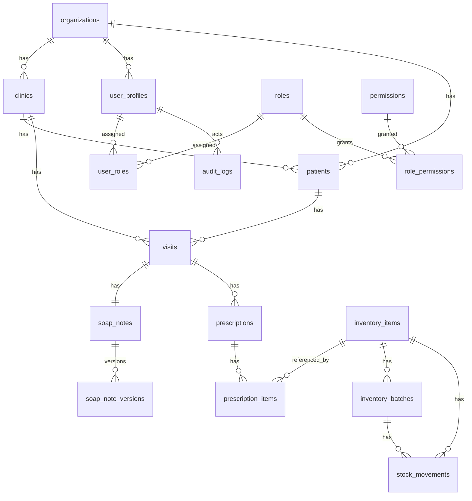

# Med AI NexSure Database Architecture MVP 1

## 1. ERD Overview

MVP 1 uses a multi-tenant Supabase PostgreSQL design centered on organizations, clinics, users, patients, visits, SOAP notes, prescriptions, inventory, RBAC, and durable audit logs. The schema is healthcare-compliant by design: UUID primary keys, tenant scoping, soft deletes, audit fields, RLS preparation, and versioned SOAP notes.

No seed data containing real PHI, PII, clinical facts, ICD codes, payer policies, or evidence is included.

## 2. Entity Relationship Summary

- One organization has many clinics.
- One organization has many user profiles, patients, visits, prescriptions, inventory records, and audit logs.
- One clinic has many users, patients, visits, prescriptions, inventory items, batches, stock movements, and audit logs.
- One patient has many visits.
- One visit belongs to one patient and one clinic.
- One visit has one SOAP note.
- One SOAP note has many SOAP note versions.
- One visit has many prescriptions.
- One prescription has many prescription items.
- Prescription items may reference inventory items.
- One inventory item has many batches.
- One inventory item has many stock movements.
- Audit logs capture actions across all major tables.
- RBAC uses roles, permissions, user_roles, and role_permissions.

## 3. Table-By-Table Schema Design

### organizations

Business purpose: Tenant root for enterprise customer data.
Primary key: `id uuid`.
Columns: `name`, `legal_name`, `registration_number`, `country_code`, `timezone`, audit fields.
Required: `name`, `country_code`, `timezone`, audit timestamps, `is_active`.
Relationships: has many clinics and user profiles.
Indexes: `organizations.name` unique.

### clinics

Business purpose: Clinic-level operational and data-scope boundary.
Primary key: `id uuid`.
Foreign keys: `organization_id -> organizations.id`.
Columns: `name`, `code`, address/contact fields, audit fields.
Required: `organization_id`, `name`, `code`, audit timestamps, `is_active`.
Relationships: belongs to organization; has many users, patients, visits, inventory records.
Indexes: `organization_id`, active scope, unique `organization_id + code`.

### user_profiles

Business purpose: Application profile mapped to `auth.users`.
Primary key: `id uuid references auth.users(id)`.
Foreign keys: `organization_id`, `primary_clinic_id`.
Columns: `display_name`, `email`, `job_title`, `department`, audit fields.
Required: `organization_id`, `display_name`, `email`.
Relationships: assigned roles through `user_roles`; referenced by clinical, audit, and inventory actions.
Indexes: `organization_id`, `primary_clinic_id`, `email`.

### roles

Business purpose: Role catalog for RBAC.
Primary key: `id uuid`.
Foreign keys: optional `organization_id`.
Columns: `name`, `description`, `is_system_role`, audit fields.
Required: `name`, `is_system_role`.
Relationships: many permissions through `role_permissions`; assigned to users through `user_roles`.
Indexes: `organization_id`, unique `organization_id + name`.

### permissions

Business purpose: Stable action keys for least-privilege access.
Primary key: `id uuid`.
Columns: `permission_key`, `description`, `domain`, audit fields.
Required: `permission_key`, `domain`.
Relationships: many roles through `role_permissions`.
Indexes: unique `permission_key`.

### user_roles

Business purpose: Assign roles to users, scoped by organization and optionally clinic.
Primary key: `id uuid`.
Foreign keys: `organization_id`, `clinic_id`, `user_id`, `role_id`.
Required: `organization_id`, `user_id`, `role_id`.
Relationships: user has many role assignments.
Indexes: `organization_id`, `clinic_id`, `user_id`, `role_id`.

### role_permissions

Business purpose: Grant permissions to roles.
Primary key: `id uuid`.
Foreign keys: `role_id`, `permission_id`.
Required: `role_id`, `permission_id`.
Relationships: role has many permissions.
Indexes: `role_id`, `permission_id`.

### patients

Business purpose: Patient record with minimal identity fields for MVP workflows.
Primary key: `id uuid`.
Foreign keys: `organization_id`, `clinic_id`, audit actor fields.
Columns: `patient_code`, `display_label`, `date_of_birth`, `sex_at_birth`, `consent_status`, `consent_updated_at`, audit fields.
Required: `organization_id`, `clinic_id`, `patient_code`, `display_label`, `consent_status`.
Relationships: patient has many visits.
Indexes: `organization_id`, `clinic_id`, `created_at`, active scope.

### visits

Business purpose: Core clinical/operational encounter record.
Primary key: `id uuid`.
Foreign keys: `organization_id`, `clinic_id`, `patient_id`, `attending_user_id`, audit actor fields.
Columns: `visit_number`, `department`, `payer_name`, `visit_status`, `claim_status`, `risk_level`, `started_at`, `completed_at`, audit fields.
Required: `organization_id`, `clinic_id`, `patient_id`, `visit_number`, `department`, statuses.
Relationships: visit has one SOAP note and many prescriptions.
Indexes: tenant scope, `patient_id`, statuses, risk, `created_at`, dashboard composite.

### soap_notes

Business purpose: Current SOAP note state for a visit.
Primary key: `id uuid`.
Foreign keys: `organization_id`, `clinic_id`, `visit_id`, `reviewed_by`, audit actor fields.
Columns: `subjective`, `objective`, `assessment`, `plan`, `status`, `current_version`, `completeness_score`, review fields, audit fields.
Required: `organization_id`, `clinic_id`, `visit_id`, `status`, `current_version`.
Relationships: one per visit; has many versions.
Indexes: `visit_id`, `status`, tenant scope.

### soap_note_versions

Business purpose: Immutable-ish version history for submitted, reviewed, or amended SOAP content.
Primary key: `id uuid`.
Foreign keys: `organization_id`, `clinic_id`, `soap_note_id`, audit actor fields.
Columns: `version`, `status`, SOAP sections, `change_reason`, audit fields.
Required: `organization_id`, `clinic_id`, `soap_note_id`, `version`, `status`, `change_reason`.
Relationships: belongs to SOAP note.
Indexes: `soap_note_id`, `created_at`, unique `soap_note_id + version`.

### prescriptions

Business purpose: Visit prescription header with clinician review status.
Primary key: `id uuid`.
Foreign keys: `organization_id`, `clinic_id`, `visit_id`, `prescribing_user_id`, audit actor fields.
Columns: `status`, `safety_review_required`, `safety_review_summary`, audit fields.
Required: tenant scope, `visit_id`, `status`.
Relationships: has many prescription items.
Indexes: `visit_id`, `status`, tenant scope.

### prescription_items

Business purpose: Medication line items, optionally linked to inventory.
Primary key: `id uuid`.
Foreign keys: `organization_id`, `clinic_id`, `prescription_id`, `inventory_item_id`, audit actor fields.
Columns: `medication_label`, `dosage_text`, `frequency_text`, `duration_text`, `quantity`, `safety_note`, audit fields.
Required: tenant scope, `prescription_id`, medication/dosage/frequency.
Relationships: belongs to prescription; may reference inventory item.
Indexes: `prescription_id`, `inventory_item_id`, tenant scope.

### inventory_items

Business purpose: Clinic inventory catalog.
Primary key: `id uuid`.
Foreign keys: `organization_id`, `clinic_id`, audit actor fields.
Columns: `sku`, `item_name`, `generic_name`, `unit`, `reorder_level`, audit fields.
Required: tenant scope, `sku`, `item_name`, `unit`.
Relationships: has many batches and stock movements.
Indexes: tenant scope, `sku`, active scope, unique `clinic_id + sku`.

### inventory_batches

Business purpose: Batch-level stock tracking.
Primary key: `id uuid`.
Foreign keys: `organization_id`, `clinic_id`, `inventory_item_id`, audit actor fields.
Columns: `batch_number`, `expiry_date`, `quantity_on_hand`, `unit_cost`, audit fields.
Required: tenant scope, `inventory_item_id`, `batch_number`, `quantity_on_hand`.
Relationships: belongs to inventory item.
Indexes: `inventory_item_id`, `expiry_date`, tenant scope.

### stock_movements

Business purpose: Immutable stock movement ledger.
Primary key: `id uuid`.
Foreign keys: `organization_id`, `clinic_id`, `inventory_item_id`, `inventory_batch_id`, audit actor fields.
Columns: `movement_type`, `quantity`, `reason`, `reference_table`, `reference_record_id`, audit fields.
Required: tenant scope, `inventory_item_id`, `movement_type`, `quantity`, `reason`.
Relationships: belongs to inventory item and optional batch.
Indexes: item, batch, movement type, `created_at`, tenant scope.

### audit_logs

Business purpose: Durable audit record for sensitive actions.
Primary key: `id uuid`.
Foreign keys: `organization_id`, `clinic_id`, `actor_user_id`.
Columns: `action_type`, `target_table`, `target_record_id`, `reason`, `old_value`, `new_value`, `ip_address`, `user_agent`, `correlation_id`, `outcome`, `created_at`.
Required: `action_type`, `target_table`, `outcome`, `created_at`.
Relationships: references actor and target by polymorphic metadata.
Indexes: tenant scope, actor, action type, target table/record, created date.

## 4. Primary Key / Foreign Key Mapping

- `clinics.organization_id -> organizations.id`
- `user_profiles.id -> auth.users.id`
- `user_profiles.organization_id -> organizations.id`
- `user_profiles.primary_clinic_id -> clinics.id`
- `patients.organization_id -> organizations.id`
- `patients.clinic_id -> clinics.id`
- `visits.organization_id -> organizations.id`
- `visits.clinic_id -> clinics.id`
- `visits.patient_id -> patients.id`
- `soap_notes.visit_id -> visits.id`
- `soap_note_versions.soap_note_id -> soap_notes.id`
- `prescriptions.visit_id -> visits.id`
- `prescription_items.prescription_id -> prescriptions.id`
- `prescription_items.inventory_item_id -> inventory_items.id`
- `inventory_batches.inventory_item_id -> inventory_items.id`
- `stock_movements.inventory_item_id -> inventory_items.id`
- `stock_movements.inventory_batch_id -> inventory_batches.id`
- `audit_logs.actor_user_id -> user_profiles.id`
- `user_roles.user_id -> user_profiles.id`
- `user_roles.role_id -> roles.id`
- `role_permissions.role_id -> roles.id`
- `role_permissions.permission_id -> permissions.id`

## 5. Relationship Cardinality

- `organizations 1:N clinics`
- `organizations 1:N user_profiles`
- `clinics 1:N patients`
- `clinics 1:N visits`
- `patients 1:N visits`
- `visits 1:1 soap_notes`
- `soap_notes 1:N soap_note_versions`
- `visits 1:N prescriptions`
- `prescriptions 1:N prescription_items`
- `inventory_items 1:N inventory_batches`
- `inventory_items 1:N stock_movements`
- `roles M:N permissions`
- `users M:N roles`

## 6. Suggested Indexes

Migration `004_indexes.sql` includes:

- Tenant indexes: `organization_id`, `clinic_id`
- Common FKs: `patient_id`, `visit_id`, `user_id`, `role_id`
- Status filters: `visit_status`, `claim_status`, `risk_level`, prescription and SOAP statuses
- Time filters: `created_at`
- Dashboard composite: `visits(organization_id, clinic_id, visit_status, claim_status, risk_level, created_at)`
- Audit lookup: `audit_logs(target_table, target_record_id)`
- Audit scope/time: `audit_logs(organization_id, clinic_id, created_at desc)`

## 7. Audit Logging Design

`audit_logs` stores durable immutable events with:

- `actor_user_id`
- `action_type`
- `target_table`
- `target_record_id`
- `reason`
- `old_value jsonb`
- `new_value jsonb`
- `ip_address`
- `user_agent`
- `correlation_id`
- `organization_id`
- `clinic_id`
- `created_at`

Audit metadata must avoid unnecessary PHI/PII. Important actions include patient changes, visit updates, SOAP changes, prescription changes, stock movement, RBAC changes, dashboard views, filters, exports, claim readiness, evidence changes, and compliance review.

## 8. Scalability Notes

- UUIDs support distributed generation.
- Composite tenant/status/date indexes support dashboards.
- Audit log indexes are scoped but limited to avoid excessive write cost.
- SOAP versions are append-friendly.
- Future high-volume tables may need partitioning by `organization_id` or `created_at`.
- Dashboard views can be added after real query patterns are known.

## 9. Security And Compliance Notes

- RLS is enabled on sensitive and tenant-scoped tables.
- Patient data access is scoped by organization and clinic.
- Audit log read is restricted to `audit_log:read`.
- Soft delete fields support retention and recovery.
- `auth.users` is the identity anchor.
- No real PHI/PII seed data is included.
- No secrets belong in migrations or docs.
- AI, clinical, and claim records remain decision support until human review workflows are defined.

## 10. Mermaid ER Diagram Code

## 11. Recommended PostgreSQL Table Creation Order

1. Extensions and enum types
2. `organizations`
3. `clinics`
4. `user_profiles`
5. `patients`
6. `visits`
7. `soap_notes`
8. `soap_note_versions`
9. `prescriptions`
10. `inventory_items`
11. `inventory_batches`
12. `prescription_items`
13. `stock_movements`
14. `audit_logs`
15. `roles`
16. `permissions`
17. `user_roles`
18. `role_permissions`
19. RLS helper functions and policies
20. Indexes

## 12. Supabase Setup Overview

See `docs/supabase-setup-mvp1.md` for setup, environment variables, auth, storage, local development, and production checklist.

## 13. Environment Variables Table

| Variable | Scope | Purpose |
| --- | --- | --- |
| `NEXT_PUBLIC_SUPABASE_URL` | Frontend-safe | Supabase project URL |
| `NEXT_PUBLIC_SUPABASE_ANON_KEY` | Frontend-safe | Public anon key protected by RLS |
| `SUPABASE_SERVICE_ROLE_KEY` | Server-only | Privileged server operations only |
| `DATABASE_URL` | Server-only | Pooled database connection |
| `DIRECT_URL` | Server-only | Direct database connection for migrations |
| `NEXT_PUBLIC_APP_URL` | Frontend-safe | Application base URL |

## 14. API Key Security Guide

- Never commit `.env.local`.
- Never expose `SUPABASE_SERVICE_ROLE_KEY` to the browser.
- Use Vercel encrypted environment variables.
- Rotate keys after suspected exposure.
- Treat anon key as public and enforce RLS.
- Prevent secrets in logs and audit metadata.

## 15. RLS Preparation

Active helper functions:

- `current_user_profile()`
- `current_user_organization_id()`
- `current_user_clinic_ids()`
- `current_user_has_role(role_name text)`
- `current_user_has_permission(permission_key text)`

Active policies include organization isolation, clinic isolation, patient/visit/SOAP/prescription/inventory scoping, audit log read restriction, and RBAC table access.

Production hardening should add consent-aware policies, reviewer assignment checks, export controls, and field-level minimization through backend DTOs.

## 16. RBAC Preparation

Required roles are defined:

- Admin
- Doctor
- Nurse
- Pharmacist
- Receptionist
- Claim Reviewer
- Compliance Officer
- Executive

Permission examples are seeded:

- `patient:read`
- `patient:create`
- `visit:read`
- `visit:update`
- `soap:read`
- `soap:update`
- `prescription:read`
- `prescription:update`
- `inventory:manage`
- `claim_readiness:read`
- `evidence_package:read`
- `audit_log:read`
- `admin:manage_users`

## 17. Storage Preparation

Evidence files should use Supabase Storage buckets in a later migration or setup step:

- `evidence-packages`
- `clinical-documents`
- `audit-exports`

Recommended controls:

- Private buckets by default
- Signed URLs with short expiry
- Object paths include organization and clinic scope
- Metadata links stored in future evidence tables
- No public buckets for PHI/PII-bearing files

## 18. Local Development Setup

1. Install Supabase CLI.
2. Add `.env.local` with local Supabase values.
3. Run migrations locally.
4. Create demo auth users manually or through safe seed scripts.
5. Assign roles through `user_profiles` and `user_roles`.
6. Verify RLS with allowed and denied users.

## 19. Production Deployment Checklist

- Back up production database before migrations.
- Apply migrations in order.
- Confirm RLS is enabled.
- Verify admin user and RBAC assignments.
- Confirm no real PHI/PII seed data is deployed.
- Store server-only keys only in protected environment settings.
- Verify audit logs write and restricted reads.
- Run QA RLS tests.
- Confirm Compliance Guard review.
- Monitor query performance and audit write volume.

## 20. Common Risks And Prevention

- Risk: service role leaks. Prevention: server-only environment variables and no browser exposure.
- Risk: RLS policy gaps. Prevention: deny-by-default tests and QA scenarios.
- Risk: audit logs contain sensitive data. Prevention: store references and minimized JSON only.
- Risk: clinic data leakage. Prevention: always include organization and clinic scope.
- Risk: hard deletion of regulated records. Prevention: soft delete fields and restrictive FKs.
- Risk: SOAP history overwritten. Prevention: `soap_note_versions`.
- Risk: payer rules invented. Prevention: future payer rules require source/version fields.

## 21. Future Expansion Readiness

Future tables, not implemented in MVP 1 migrations:

- `claim_readiness_assessments`
- `claim_readiness_items`
- `evidence_packages`
- `evidence_package_items`
- `diagnoses`
- `visit_diagnoses`
- `medical_certificates`
- `ai_soap_summaries`
- `ai_icd_suggestions`
- `payer_rules`
- `insurance_rule_checks`
- `compliance_reports`

These should be versioned, tenant-scoped, auditable, and RLS-protected.

## 22. Definition Of Done

- Migrations are additive and ordered.
- Required MVP 1 tables are present.
- Audit fields are present on mutable tables.
- Durable `audit_logs` table exists.
- RLS is enabled on sensitive tables.
- RBAC tables and seed roles/permissions exist.
- Indexes support tenant, workflow, and dashboard queries.
- Documentation includes ERD and setup guidance.
- No real PHI/PII is inserted.
