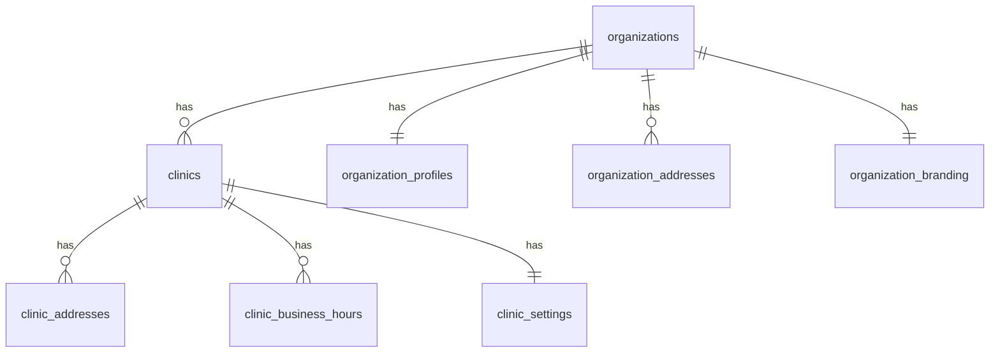
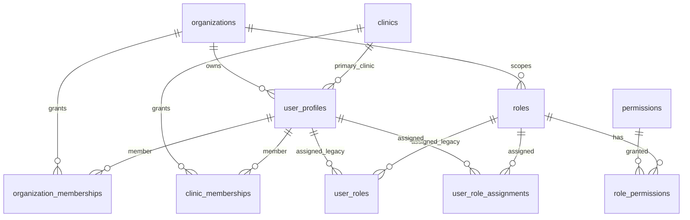
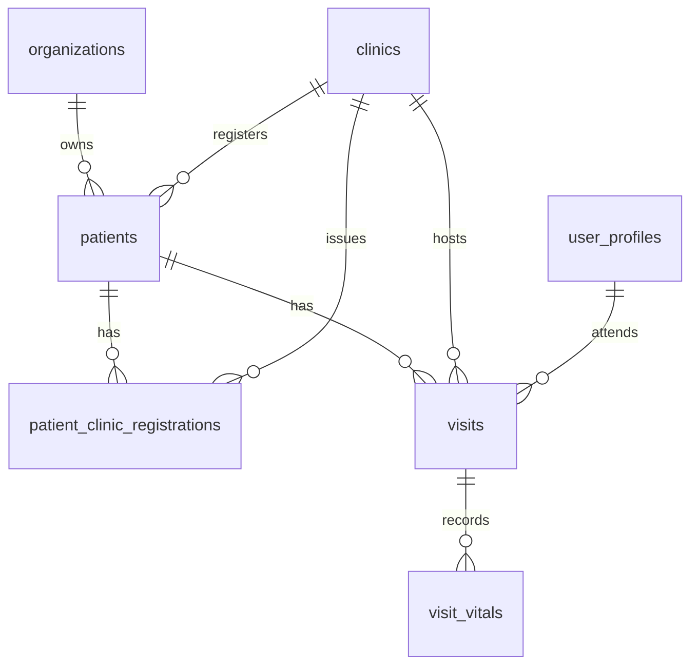
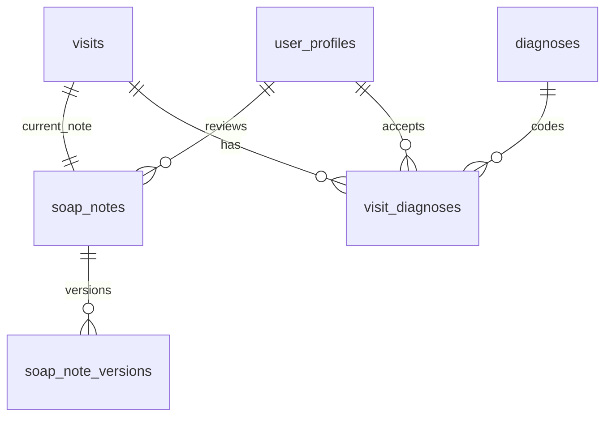
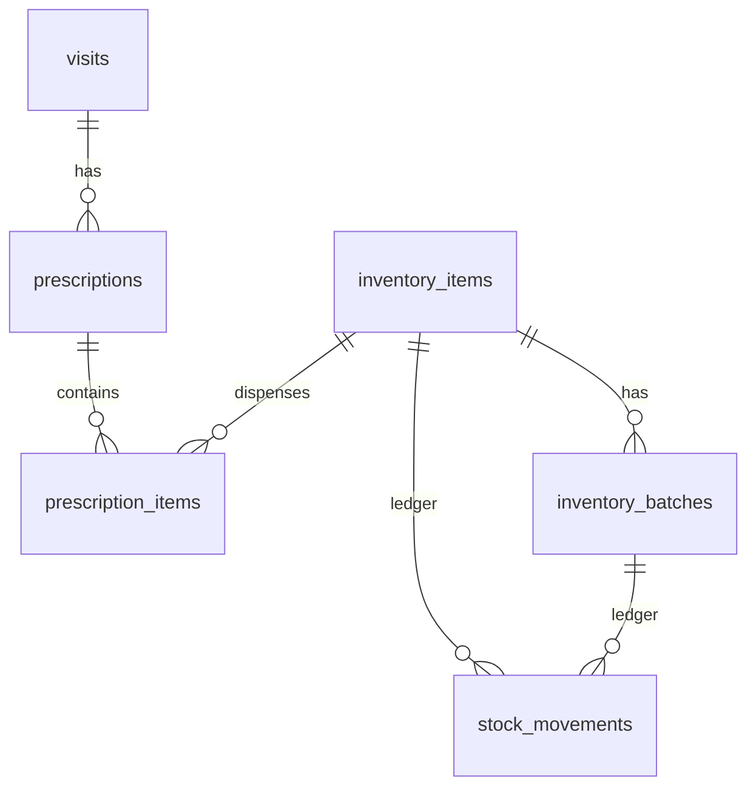
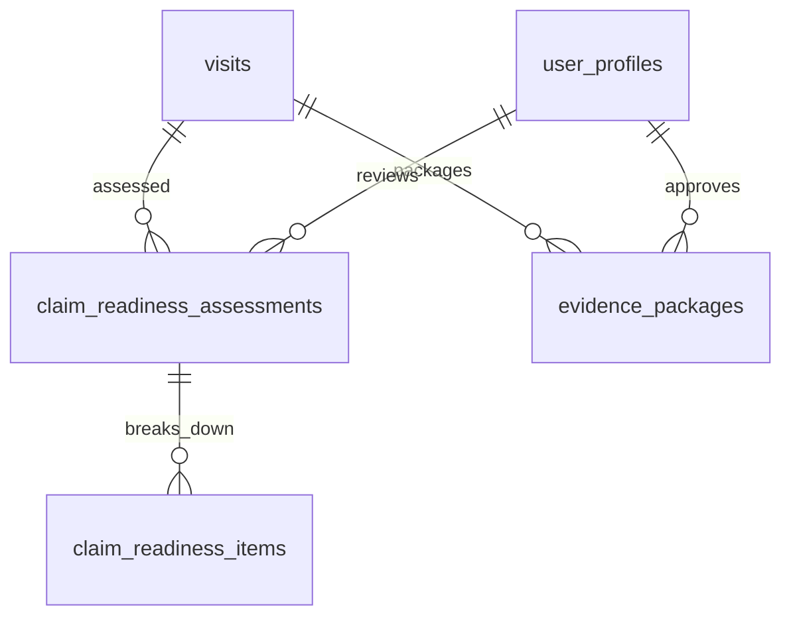
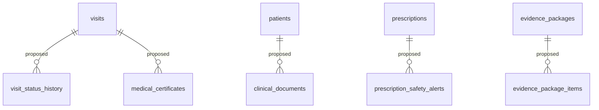

# Entity Relationship Diagrams

Diagrams are separated by module to keep Mermaid blocks reviewable.

## Foundation

## Identity and RBAC

## Patients and Visits

## Clinical Documentation

## Prescriptions and Inventory

## Claim and Evidence

## Settings, Integrations, and Audit

```mermaid
erDiagram
  organizations ||--|| organization_operational_settings : configures
  organizations ||--|| organization_claim_settings : configures
  organizations ||--|| organization_clinical_settings : configures
  organizations ||--|| organization_security_settings : configures
  organizations ||--|| organization_compliance_settings : configures
  system_modules ||--o{ organization_module_settings : toggles
  organizations ||--o{ organization_module_settings : owns
  notification_event_types ||--o{ organization_notification_settings : configures
  integration_providers ||--o{ organization_integrations : connects
  organizations ||--o{ organization_setting_versions : versions
  organizations ||--o{ audit_logs : records
  clinics ||--o{ audit_logs : scopes
  user_profiles ||--o{ audit_logs : acts
```

## Proposed Future Tables

