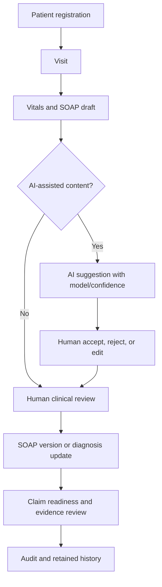

# Clinical Data Governance

Source of truth: completed Core Foundation documents and migrations `001_core_schema.sql`, `006_clinical_claim_settings_tables.sql`, and `007_rbac_helpers_policies_indexes_seed.sql`.

## Existing Implementation

### Governed Clinical Data Sets

| Domain | Existing tables | Governance controls |
| --- | --- | --- |
| Patients | `patients`, `patient_clinic_registrations` | Tenant and clinic scope, consent status, soft delete, RLS, audit fields |
| Visits | `visits`, `visit_vitals` | Visit status enums, clinic scope, attending user, vitals checks, RLS |
| SOAP notes | `soap_notes`, `soap_note_versions` | One current SOAP note per visit, version history, change reason, completeness check |
| Diagnoses | `diagnoses`, `visit_diagnoses` | ICD-like code catalog, visit coding status, AI source metadata, human acceptance checks |
| Prescriptions | `prescriptions`, `prescription_items` | Prescription status enum, safety review flag, dispensed quantity check |
| Claims/evidence | `claim_readiness_assessments`, `claim_readiness_items`, `evidence_packages` | Readiness score constraints, review status, evidence package versioning |
| Audit | `audit_logs`, actor columns | Action type, target metadata, outcome, correlation id, old/new minimized JSON |

### Human-in-the-Loop Controls

Existing:
- `soap_notes` has `source_type`, `model_name`, `model_version`, `confidence`, `accepted_by`, `accepted_at`, and `edited_after_generation`.
- `ck_soap_notes_ai_acceptance` requires accepted AI SOAP content in reviewed status to have `accepted_by` and `accepted_at`.
- `visit_diagnoses` has `source_type`, `model_name`, `model_version`, `confidence`, `accepted_by`, `accepted_at`, and `edited_after_generation`.
- `ck_visit_diagnoses_ai_acceptance` requires accepted AI-coded diagnosis rows to have `accepted_by` and `accepted_at`.
- `organization_clinical_settings` includes `require_ai_human_acceptance` and `allow_ai_diagnosis_suggestions`.

### Clinical Data Integrity Constraints

| Table | Existing checks |
| --- | --- |
| `patients` | `consent_status` values: `unknown`, `granted`, `restricted`, `revoked`, `expired`; `sex_at_birth` controlled values |
| `visit_vitals` | positive measurements; oxygen saturation 0-100; systolic/diastolic blood pressure relationship |
| `soap_notes` | completeness score 0-100; AI confidence 0-100 |
| `soap_note_versions` | `version > 0`; `change_reason` required |
| `visit_diagnoses` | diagnosis type, coding status, source type, confidence, and AI acceptance checks |
| `prescription_items` | quantity positive when present; `dispensed_quantity >= 0` and not greater than quantity |
| `claim_readiness_assessments` | score 0-100 and readiness status must match score band |
| `claim_readiness_items` | score/weight checks; dimension codes limited to six defined dimensions |
| `evidence_packages` | completeness score 0-100; package status controlled values |

### Clinical Access Model

Existing:
- Migration `003` uses colon permissions such as `patient:read`, `soap:update`, and `prescription:update`.
- Migration `007` uses dot permissions such as `patient.view`, `soap.update`, `soap.approve_ai_content`, `prescription.create`, and `prescription.dispense`.
- RLS policies require organization and clinic access before clinical row access.
- `doctor`, `nurse`, `pharmacist`, `claim_reviewer`, `compliance_officer`, and `auditor` roles are seeded in the migration `007` model.

### Clinical Governance Flow

## Identified Gaps

- `clinical_documents` is not implemented; evidence storage currently has buckets and `evidence_packages`, but not a clinical document metadata table.
- `medical_certificates` is not implemented as a table.
- `visit_status_history` is not implemented; `visits` stores current status only.
- `prescription_safety_alerts` is not implemented; prescription safety is represented by header fields and item notes.
- Storage buckets are private, but storage object RLS policies are not present.
- No executable SQL tests exist for clinical RLS, AI acceptance checks, or claim readiness constraints.
- Current app modules are mostly mock-backed, so many clinical governance rules are not yet exercised by live Supabase queries.
- Two RBAC and permission naming models coexist, increasing the risk of inconsistent clinical access.

## Proposed Design

Proposed clinical governance additions:
- Proposed: `clinical_documents` metadata table for patient/visit document records linked to private storage objects.
- Proposed: `medical_certificates` table for issued certificates, status, signer, storage reference, checksum, version, and amendment reason.
- Proposed: `visit_status_history` append-only table for status transitions with actor, reason, previous status, next status, and timestamp.
- Proposed: `prescription_safety_alerts` table for drug interaction, allergy, contraindication, duplicate therapy, dose, and inventory alerts with override reason.
- Proposed: canonical permission keys for high-risk clinical actions, such as `clinical.sign`, `clinical.amend`, `prescription.override_safety_alert`, and `document.download`.
- Proposed: storage object policies requiring organization/clinic scope and short-lived signed URLs.
- Proposed: SQL tests for cross-tenant denial, cross-clinic denial, AI acceptance constraints, SOAP versioning, diagnosis coding status, and prescription dispense limits.

Related references:
- [Core Foundation Security Model](core-foundation-security-model.md)
- [Core Foundation Test Plan](core-foundation-test-plan.md)
