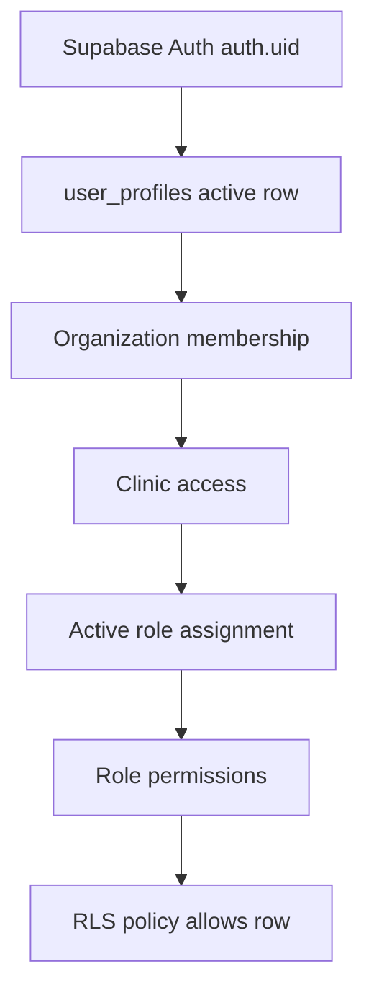

# Core Foundation Security Model

Source of truth: Supabase migrations `003_rls_policies.sql`, `005_tenant_identity_memberships.sql`, and `007_rbac_helpers_policies_indexes_seed.sql`.

## Existing Implementation

### Security Principles Implemented

- Supabase Auth user id anchors `user_profiles.id`.
- Organization tenant scope is represented by `organization_id`.
- Clinic scope is represented by `clinic_id`.
- Mutable business tables use soft-delete fields.
- RLS is enabled on core clinical, RBAC, audit, membership, and settings tables.
- Helper functions are `security definer`, stable, and use `set search_path = public`.
- Migration `007` revokes helper execution from `public` and grants execution to `authenticated`.

### RLS Helper Functions

#### Migration `003` Helpers

| Function | Purpose | Uses |
| --- | --- | --- |
| `current_user_profile()` | Returns active profile row for `auth.uid()` | user profile lookup |
| `current_user_organization_id()` | Returns active user's organization id | tenant filtering |
| `current_user_clinic_ids()` | Returns primary clinic and clinic ids from active `user_roles` | clinic filtering |
| `current_user_has_role(role_name text)` | Checks active role by name through `user_roles` | executive/admin exceptions |
| `current_user_has_permission(permission_key text)` | Checks active permission through `user_roles`, `role_permissions`, and `permissions` | policy predicates |

#### Migration `007` Helpers

| Function | Purpose | Grant |
| --- | --- | --- |
| `current_user_profile_id()` | Returns active user profile id | `authenticated` |
| `is_organization_member(uuid)` | Checks `organization_memberships` or active `user_profiles.organization_id` | `authenticated` |
| `has_clinic_access(uuid, uuid)` | Checks clinic membership, primary clinic, or organization-level active role assignment | `authenticated` |
| `has_permission(text, uuid, uuid)` | Checks organization membership, clinic access, active non-expired `user_role_assignments`, active role, active permission | `authenticated` |

Compatibility Sensitive:
- Migration `003` policies use colon permission keys and `user_roles`.
- Migration `007` policies use dot permission keys and `user_role_assignments`.

### RLS Enabled Tables

Migration `003` enables RLS on:

| Area | Tables |
| --- | --- |
| Tenant and identity | `organizations`, `clinics`, `user_profiles` |
| Clinical | `patients`, `visits`, `soap_notes`, `soap_note_versions`, `prescriptions`, `prescription_items` |
| Inventory | `inventory_items`, `inventory_batches`, `stock_movements` |
| Audit | `audit_logs` |
| RBAC | `roles`, `permissions`, `user_roles`, `role_permissions` |

Migration `007` additionally enables RLS on:

| Area | Tables |
| --- | --- |
| Organization and clinic profile | `organization_profiles`, `organization_addresses`, `organization_branding`, `clinic_addresses`, `clinic_business_hours`, `clinic_settings` |
| Membership and assignment | `organization_memberships`, `clinic_memberships`, `user_role_assignments` |
| Clinical expansion | `patient_clinic_registrations`, `visit_vitals`, `diagnoses`, `visit_diagnoses` |
| Claims and evidence | `claim_readiness_assessments`, `claim_readiness_items`, `evidence_packages` |
| Settings and integrations | `organization_operational_settings`, `organization_clinical_settings`, `organization_claim_settings`, `organization_security_settings`, `organization_compliance_settings`, `system_modules`, `organization_module_settings`, `notification_event_types`, `organization_notification_settings`, `integration_providers`, `organization_integrations`, `organization_setting_versions` |

### RLS Policies from Migration `003`

| Policy | Table | Operation | Access condition summary |
| --- | --- | --- | --- |
| `organizations_select_scoped` | `organizations` | select | current organization or `admin:manage_users` |
| `clinics_select_scoped` | `clinics` | select | same organization and clinic access, admin, or Executive |
| `user_profiles_select_scoped` | `user_profiles` | select | self, or same organization with `admin:manage_users` |
| `user_profiles_update_own` | `user_profiles` | update | self only |
| `patients_select_clinic_scoped` | `patients` | select | organization, clinic, `patient:read` |
| `patients_insert_clinic_scoped` | `patients` | insert | organization, clinic, `patient:create` |
| `visits_select_clinic_scoped` | `visits` | select | organization, clinic, `visit:read` |
| `visits_update_clinic_scoped` | `visits` | update | organization, clinic, `visit:update` |
| `soap_notes_select_scoped` | `soap_notes` | select | organization, clinic, `soap:read` |
| `soap_notes_write_scoped` | `soap_notes` | all | organization, clinic, `soap:update` |
| `soap_note_versions_select_scoped` | `soap_note_versions` | select | organization, clinic, `soap:read` |
| `soap_note_versions_insert_scoped` | `soap_note_versions` | insert | organization, clinic, `soap:update` |
| `prescriptions_select_scoped` | `prescriptions` | select | organization, clinic, `prescription:read` |
| `prescriptions_write_scoped` | `prescriptions` | all | organization, clinic, `prescription:update` |
| `prescription_items_select_scoped` | `prescription_items` | select | organization, clinic, `prescription:read` |
| `prescription_items_write_scoped` | `prescription_items` | all | organization, clinic, `prescription:update` |
| `inventory_items_manage_scoped` | `inventory_items` | all | organization, clinic, `inventory:manage` |
| `inventory_batches_manage_scoped` | `inventory_batches` | all | organization, clinic, `inventory:manage` |
| `stock_movements_manage_scoped` | `stock_movements` | all | organization, clinic, `inventory:manage` |
| `audit_logs_read_restricted` | `audit_logs` | select | organization, clinic/Executive, `audit_log:read` |
| `audit_logs_insert_scoped` | `audit_logs` | insert | organization and optional clinic access |
| `roles_select_scoped` | `roles` | select | system role or same organization |
| `permissions_select_authenticated` | `permissions` | select | any authenticated user |
| `user_roles_select_scoped` | `user_roles` | select | self or organization admin |
| `user_roles_manage_admin` | `user_roles` | all | organization admin |
| `role_permissions_select_authenticated` | `role_permissions` | select | any authenticated user |

### RLS Policies from Migration `007`

Before creating `mvp1_*` policies, migration `007` drops existing policies whose names match `mvp1_%`.

| Policy | Table | Operation | Permission style |
| --- | --- | --- | --- |
| `mvp1_organizations_select` | `organizations` | select | organization membership |
| `mvp1_clinics_select` | `clinics` | select | `clinic.view` |
| `mvp1_patients_select` | `patients` | select | `patient.view` |
| `mvp1_patients_insert` | `patients` | insert | `patient.create` |
| `mvp1_patients_update` | `patients` | update | `patient.update` |
| `mvp1_visits_select` | `visits` | select | `visit.view` |
| `mvp1_visits_insert` | `visits` | insert | `visit.create` |
| `mvp1_visits_update` | `visits` | update | `visit.update_status` |
| `mvp1_soap_select` | `soap_notes` | select | `soap.view` |
| `mvp1_soap_insert` | `soap_notes` | insert | `soap.create` |
| `mvp1_soap_update` | `soap_notes` | update | `soap.update` |
| `mvp1_prescriptions_select` | `prescriptions` | select | `prescription.view` |
| `mvp1_prescriptions_insert` | `prescriptions` | insert | `prescription.create` |
| `mvp1_prescriptions_update` | `prescriptions` | update | `prescription.create` or `prescription.dispense` |
| `mvp1_inventory_select` | `inventory_items` | select | `inventory.view` |
| `mvp1_inventory_insert` | `inventory_items` | insert | `inventory.adjust` |
| `mvp1_inventory_update` | `inventory_items` | update | `inventory.adjust` |
| `mvp1_inventory_batches_select` | `inventory_batches` | select | `inventory.view` |
| `mvp1_inventory_batches_insert` | `inventory_batches` | insert | `inventory.adjust` |
| `mvp1_inventory_batches_update` | `inventory_batches` | update | `inventory.adjust` |
| `mvp1_stock_movements_select` | `stock_movements` | select | `inventory.view` |
| `mvp1_stock_movements_insert` | `stock_movements` | insert | `inventory.adjust` |
| `mvp1_claim_select` | `claim_readiness_assessments` | select | `claim.view` |
| `mvp1_claim_review` | `claim_readiness_assessments` | update | `claim.review` |
| `mvp1_evidence_select` | `evidence_packages` | select | `claim.view` |
| `mvp1_claim_items_select` | `claim_readiness_items` | select | `claim.view` |
| `mvp1_claim_items_review` | `claim_readiness_items` | update | `claim.review` |
| `mvp1_visit_vitals_select` | `visit_vitals` | select | `visit.view` |
| `mvp1_visit_vitals_insert` | `visit_vitals` | insert | `visit.update_status` |
| `mvp1_visit_vitals_update` | `visit_vitals` | update | `visit.update_status` |
| `mvp1_visit_diagnoses_select` | `visit_diagnoses` | select | `soap.view` |
| `mvp1_visit_diagnoses_insert` | `visit_diagnoses` | insert | `soap.update` |
| `mvp1_visit_diagnoses_update` | `visit_diagnoses` | update | `soap.update` |
| `mvp1_diagnoses_select` | `diagnoses` | select | organization membership |
| `mvp1_org_settings_select` | `organization_claim_settings` | select | `organization.view` |
| `mvp1_org_settings_update` | `organization_claim_settings` | update | `organization.update` |
| settings select policies | settings tables | select | `organization.view` |
| `mvp1_clinic_memberships_select` | `clinic_memberships` | select | organization and clinic access |
| `mvp1_memberships_select` | `organization_memberships` | select | organization membership |
| `mvp1_role_assignments_select` | `user_role_assignments` | select | self or `role.assign` |
| `mvp1_audit_logs_select` | `audit_logs` | select | `audit.view` |
| `mvp1_audit_logs_insert` | `audit_logs` | insert | organization member and optional clinic access |

### Access Flow

## Identified Gaps

- Two RLS generations coexist. Migration `007` only drops prior `mvp1_%` policies, not the migration `003` policy names, so both policy families can be active.
- Permission keys are split between colon format and dot format.
- `user_roles` and `user_role_assignments` both grant access in different helper functions.
- No SQL-based RLS regression tests exist in `supabase/tests/`.
- Storage buckets are private but object-level policies are not defined.
- Some policies grant broad authenticated reads of catalog tables such as `permissions` and `role_permissions`.

## Proposed Design

- Canonicalize on one RBAC assignment model and one permission key format before live domain repositories depend on RLS.
- Prefer `user_role_assignments` for future access because it includes assignment status, expiry, assigned actor, and soft delete.
- Replace or retire older migration `003` policies after a compatibility migration and test suite confirm equivalent behavior.
- Add storage object RLS policies for `organization-assets`, `patient-documents`, `evidence-files`, `medical-certificates`, and `integration-files`.
- Add RLS tests for anonymous denial, authenticated no-profile denial, cross-organization denial, cross-clinic denial, role assignment expiry, suspended memberships, and least-privilege mutation checks.

## Migration 009 RLS Policy Hardening Update

Task: DB-P1-RLS-POLICY-HARDENING

Migration implemented: `supabase/migrations/009_core_foundation_rls_policy_hardening.sql`.

Policy consolidation:

- Removed legacy Core Foundation policies from migration `003`: `organizations_select_scoped`, `clinics_select_scoped`, `user_profiles_select_scoped`, `user_profiles_update_own`, `roles_select_scoped`, `permissions_select_authenticated`, `role_permissions_select_authenticated`, `user_roles_select_scoped`, and `user_roles_manage_admin`.
- Removed and replaced overlapping `mvp1_organizations_select` and `mvp1_clinics_select`.
- Retained replacement-table compatibility policies `mvp1_memberships_select`, `mvp1_clinic_memberships_select`, and `mvp1_role_assignments_select`.
- No in-scope Core Foundation table has an `ALL` or `DELETE` policy after migration `009`.
- `user_profiles` and legacy `user_roles` have no direct mutation policy after migration `009`.

Canonical RLS policy model:

| Table | Policy | Command | USING rule | WITH CHECK rule |
|---|---|---|---|---|
| `organizations` | `organizations_select_own_scope` | SELECT | `is_organization_member(id)` | None |
| `clinics` | `clinics_select_authorized_scope` | SELECT | `has_clinic_access(organization_id, id)` and `has_permission('clinic.view', organization_id, id)` | None |
| `user_profiles` | `user_profiles_select_self_or_admin` | SELECT | `id = auth.uid()` or `has_permission('role.assign', organization_id, primary_clinic_id)` | None |
| `roles` | `roles_select_catalog_scope` | SELECT | Global role or `is_organization_member(organization_id)` | None |
| `permissions` | `permissions_select_catalog_scope` | SELECT | Active and not soft-deleted | None |
| `role_permissions` | `role_permissions_select_catalog_scope` | SELECT | Active mapping for active global or member-organization role | None |
| `user_roles` | `user_roles_select_self_or_admin` | SELECT | `user_id = auth.uid()` or `has_permission('role.assign', organization_id, clinic_id)` | None |

Security result:

- Permissive-policy OR broadening between migration `003` and `mvp1_*` Core Foundation policies was removed for the in-scope tables.
- Clinic visibility now requires both clinic access and an explicit `clinic.view` permission.
- Catalog visibility no longer exposes inactive or soft-deleted permissions and mappings.
- Direct self-assignment through legacy `user_roles` remains denied because mutation grants were removed in migration `008` and mutation policies were removed in migration `009`.

Open security boundaries:

- Tenant-safe composite foreign keys are not yet enforced.
- Organization and clinic lifecycle states are not yet constrained.
- Role assignment administration still needs a controlled workflow, audit model, and runtime tests.
- Domain policies outside the Core Foundation scope still need separate consolidation.

## Migration 011 Lifecycle Security Update

Task: DB-P1-LIFECYCLE-CONTROLS-HARDENING

Migration implemented: `supabase/migrations/011_core_foundation_lifecycle_controls.sql`.

Lifecycle security model:

- Normal operational authorization helpers now require active organization lifecycle state.
- Clinic-scoped helper access also requires the clinic lifecycle state to be active.
- Organization lifecycle overrides clinic lifecycle; an active clinic inside a suspended, closed, or archived organization is operationally unavailable.
- Lifecycle transitions occur only through controlled SECURITY DEFINER functions with fixed `search_path = public`.
- The functions do not accept actor IDs from callers; actor identity is derived from `auth.uid()`.
- Transition functions require a non-empty reason and reject unsupported or skipped transitions.
- Anonymous and public execution are revoked; authenticated execution is granted only for the controlled functions.

Permission mapping:

| Permission | Purpose |
|---|---|
| `organization.lifecycle.read` | Read organization lifecycle state. |
| `organization.lifecycle.suspend` | Move organization from active to suspended. |
| `organization.lifecycle.reactivate` | Platform recovery for suspended to active. |
| `organization.lifecycle.close` | Move active or suspended organization to closed. |
| `organization.lifecycle.archive` | Move closed organization to archived. |
| `clinic.lifecycle.read` | Read clinic lifecycle state. |
| `clinic.lifecycle.suspend` | Move clinic from active to suspended. |
| `clinic.lifecycle.reactivate` | Move suspended clinic to active when organization is active. |
| `clinic.lifecycle.close` | Move active or suspended clinic to closed. |
| `clinic.lifecycle.archive` | Move closed clinic to archived. |

Role mapping:

- `platform_admin` receives all organization and clinic lifecycle permissions and provides the explicit platform recovery path.
- `organization_admin` receives organization suspend, close, archive, and clinic lifecycle permissions, but not organization reactivation.
- `clinic_admin` receives clinic lifecycle permissions.

Audit boundary:

- Transition reasons, actor identity, target identifiers, and controlled workflow boundaries are present for future audit integration.
- Full lifecycle audit event emission remains a separate audit workflow task.

## Migration 012 Controlled Role Assignment Security Update

Task: DB-P1-CONTROLLED-ROLE-ASSIGNMENT-WORKFLOW

Migration implemented: `supabase/migrations/012_core_foundation_controlled_role_assignment.sql`.

Security model:

- `user_role_assignments` is the authoritative assignment table for new controlled writes.
- Normal authenticated users cannot directly insert, update, or delete `user_role_assignments` or legacy `user_roles`.
- Role assignment and revocation are exposed only through `assign_role(...)` and `revoke_role_assignment(...)`.
- Both functions are SECURITY DEFINER with fixed `search_path = public`.
- `public` and `anon` EXECUTE are revoked; `authenticated` receives EXECUTE only on the two workflow functions.
- Actor identity is derived from `auth.uid()`; no caller-supplied actor id is accepted.
- Target organization, clinic, profile, membership, role, lifecycle, dates, self-assignment, and platform-role authority are checked inside the transaction.

Permission mapping:

| Permission | Purpose |
|---|---|
| `role_assignment.read` | Read controlled assignment workflow state. |
| `role_assignment.assign` | Assign non-platform roles through the workflow. |
| `role_assignment.revoke` | Revoke non-platform roles through the workflow. |
| `role_assignment.manage_expiry` | Set assignment expiry through the workflow. |
| `role_assignment.assign_platform_role` | Assign or revoke protected platform roles. |

Role mapping:

- `platform_admin` receives all role-assignment workflow permissions, including platform-role assignment.
- `organization_admin` receives read, assign, revoke, and expiry workflow permissions within tenant scope.
- `clinic_admin` receives read, assign, revoke, and expiry workflow permissions within clinic scope only.

Audit boundary:

- Functions derive actor, target profile, role, organization, clinic, action, reason, before state, and after state.
- Durable audit events such as `role_assignment.created`, `role_assignment.revoked`, and `privilege_escalation.denied` remain for DB-P1-CORE-AUDIT-EVENT-IMPLEMENTATION.

## Migration 013 Core Foundation Audit Security Update

Task: DB-P1-CORE-AUDIT-EVENT-IMPLEMENTATION

Migration implemented: `supabase/migrations/013_core_foundation_audit_events.sql`.

Security model:

- `audit_logs` remains the authoritative durable audit table.
- Normal runtime roles cannot directly insert, update, or delete audit rows.
- Core Foundation audit appends occur through internal `append_core_audit_event(...)` only.
- The internal append helper is SECURITY DEFINER with fixed `search_path = public` and is not granted to `anon` or `authenticated`.
- Organization lifecycle, clinic lifecycle, role assignment, and role revocation functions append audit events in the same transaction as the protected mutation.
- Audit append failure rolls back the protected mutation.
- Audit read access remains scoped by RLS and `audit.view`.
- Audit JSON payloads are minimized and screened for prohibited secret-like keys and token-like values.

Implemented durable event boundary:

| Workflow | Events |
|---|---|
| Organization lifecycle | `organization.lifecycle.suspended`, `organization.lifecycle.reactivated`, `organization.lifecycle.closed`, `organization.lifecycle.archived` |
| Clinic lifecycle | `clinic.lifecycle.suspended`, `clinic.lifecycle.reactivated`, `clinic.lifecycle.closed`, `clinic.lifecycle.archived` |
| Controlled role assignment | `role_assignment.created`, `role_assignment.revoked` |

Remaining security work:

- Denied/failed workflow event taxonomy outside the tested fail-closed path remains future governance work.
- Cross-domain audit events, audit export controls, tamper evidence, retention automation, and break-glass audit design remain later-phase work.

## Full Core Foundation Regression Security Exit Review

Task: DB-P1-FULL-CORE-FOUNDATION-REGRESSION

Security validation evidence:

- Full local database test suite passed: 9 files, 229 tests, 0 failed.
- Tenant isolation, clinic isolation, RLS `USING` and `WITH CHECK`, tenant-field mutation denial, tenant-safe FK rejection, revoked and expired assignment denial, lifecycle denial, self-assignment denial, platform-role escalation denial, audit read isolation, audit append-only controls, audit transaction rollback, and metadata minimization are covered by executable pgTAP tests.
- Migration source scan confirms Core Foundation SECURITY DEFINER functions use fixed `search_path = public`.
- Migration source scan confirms public/anon execution is revoked for sensitive helpers and controlled workflow functions; authenticated execution is limited to approved wrappers.
- Migration source scan confirms direct runtime mutation is revoked for `user_role_assignments`, legacy `user_roles`, and `audit_logs`.
- App source scan found no browser service-role usage under `app/`, `features/`, or `lib/`.
- App source scan found no direct Core Foundation role-assignment or audit table write integration in UI code.

Findings:

| Severity | Finding | Status |
|---|---|---|
| Informational | Core Foundation UI screens currently use mock/static data and do not call lifecycle RPCs, controlled role-assignment RPCs, or audit queries. | Non-blocking follow-up |
| Informational | `npx supabase status` was not executed because approval review rejected the command due potential local secret-bearing output. | Documented limitation |

Release recommendation:

READY WITH NON-BLOCKING FOLLOW-UP for Phase 1 Core Foundation database regression.
