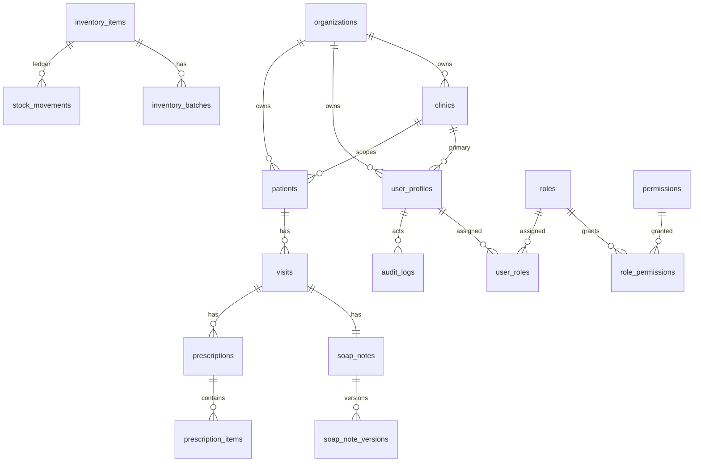

# Core Foundation Specification

Source of truth: `supabase/migrations/001_core_schema.sql`, `002_rbac.sql`, `003_rls_policies.sql`, `004_indexes.sql`, `005_tenant_identity_memberships.sql`, and core RBAC/security portions of `007_rbac_helpers_policies_indexes_seed.sql`.

## Existing Implementation

### Foundation Scope

The core foundation establishes:
- Supabase Auth anchored application users.
- Organization tenant boundary.
- Clinic operational boundary.
- Patient, visit, SOAP, prescription, inventory, RBAC, and audit primitives.
- UUID primary keys generated through `pgcrypto`.
- Soft-delete and audit columns on mutable domain tables.
- RLS helpers and policies for staged tenant isolation.

### Extension, Function, and Enum Objects

| Object | Type | Definition |
| --- | --- | --- |
| `pgcrypto` | extension | Enables `gen_random_uuid()` for UUID primary keys. |
| `set_updated_at()` | trigger function | Sets `new.updated_at = now()` before row updates. |
| `visit_status` | enum | `scheduled`, `checked_in`, `in_consultation`, `completed`, `cancelled`, `no_show` |
| `claim_status` | enum | `not_started`, `documentation_pending`, `ready_for_review`, `needs_review`, `blocked`, `submitted` |
| `risk_level` | enum | `low`, `medium`, `high`, `critical` |
| `audit_action_type` | enum | `create`, `read`, `update`, `delete`, `view`, `export`, `login`, `permission_change`, `clinical_review`, `claim_review`, `evidence_change`, `dashboard_viewed`, `filters_applied` |
| `stock_movement_type` | enum | `stock_in`, `stock_out`, `adjustment`, `return`, `waste`, `transfer` |
| `prescription_status` | enum | `draft`, `pending_review`, `approved_by_clinician`, `dispensed`, `cancelled` |
| `soap_status` | enum | `draft`, `submitted`, `reviewed`, `amended`, `archived` |

### Core Tables and Columns

| Table | Existing columns | Primary and foreign keys | Constraints |
| --- | --- | --- | --- |
| `organizations` | `id`, `name`, `legal_name`, `registration_number`, `country_code`, `timezone`, `created_at`, `created_by`, `updated_at`, `updated_by`, `deleted_at`, `deleted_by`, `is_active`; migration `005` adds `code`, `organization_type`, `locale` | PK `id` | `organizations_name_unique`; `uq_organizations_code_active` partial unique index |
| `clinics` | `id`, `organization_id`, `name`, `code`, `address_line`, `province`, `country_code`, `phone`, audit columns; migration `005` adds `clinic_type`, `is_primary` | PK `id`; FK `organization_id -> organizations.id`; actor FKs to `user_profiles`; migration `005` adds unique `(organization_id, id)` | `clinics_org_code_unique`; `uq_clinics_organization_id_id` |
| `user_profiles` | `id`, `organization_id`, `primary_clinic_id`, `display_name`, `email`, `job_title`, `department`, audit columns | PK/FK `id -> auth.users.id`; FK `organization_id -> organizations.id`; FK `primary_clinic_id -> clinics.id`; migration `005` adds tenant-safe FK `(organization_id, primary_clinic_id) -> clinics(organization_id, id)` | `user_profiles_email_unique`; `fk_user_profiles_primary_clinic_tenant` |
| `patients` | `id`, `organization_id`, `clinic_id`, `patient_code`, `display_label`, `date_of_birth`, `sex_at_birth`, `consent_status`, `consent_updated_at`, audit columns | PK `id`; FKs to organization, clinic, actor user profiles | `patients_org_code_unique`; consent status check; sex-at-birth check |
| `visits` | `id`, `organization_id`, `clinic_id`, `patient_id`, `visit_number`, `department`, `attending_user_id`, `payer_name`, `visit_status`, `claim_status`, `risk_level`, `started_at`, `completed_at`, audit columns | PK `id`; FKs to organization, clinic, patient, attending user, actors | `visits_org_visit_number_unique` |
| `soap_notes` | `id`, `organization_id`, `clinic_id`, `visit_id`, `status`, `current_version`, `subjective`, `objective`, `assessment`, `plan`, `completeness_score`, `reviewed_by`, `reviewed_at`, audit columns | PK `id`; FKs to organization, clinic, visit, reviewer, actors | `soap_notes_visit_unique`; completeness score 0-100 check |
| `soap_note_versions` | `id`, `organization_id`, `clinic_id`, `soap_note_id`, `version`, `status`, `subjective`, `objective`, `assessment`, `plan`, `change_reason`, audit columns | PK `id`; FKs to organization, clinic, SOAP note, actors | unique `(soap_note_id, version)`; version positive check |
| `prescriptions` | `id`, `organization_id`, `clinic_id`, `visit_id`, `prescribing_user_id`, `status`, `safety_review_required`, `safety_review_summary`, audit columns | PK `id`; FKs to organization, clinic, visit, prescribing user, actors | enum status |
| `prescription_items` | `id`, `organization_id`, `clinic_id`, `prescription_id`, `inventory_item_id`, `medication_label`, `dosage_text`, `frequency_text`, `duration_text`, `quantity`, `safety_note`, audit columns | PK `id`; FKs to organization, clinic, prescription, inventory item, actors | quantity is null or > 0 |
| `inventory_items` | `id`, `organization_id`, `clinic_id`, `sku`, `item_name`, `generic_name`, `unit`, `reorder_level`, audit columns | PK `id`; FKs to organization, clinic, actors | unique `(clinic_id, sku)`; reorder level >= 0 |
| `inventory_batches` | `id`, `organization_id`, `clinic_id`, `inventory_item_id`, `batch_number`, `expiry_date`, `quantity_on_hand`, `unit_cost`, audit columns | PK `id`; FKs to organization, clinic, inventory item, actors | unique `(inventory_item_id, batch_number)`; quantity >= 0; cost null or >= 0 |
| `stock_movements` | `id`, `organization_id`, `clinic_id`, `inventory_item_id`, `inventory_batch_id`, `movement_type`, `quantity`, `reason`, `reference_table`, `reference_record_id`, audit columns | PK `id`; FKs to organization, clinic, inventory item, inventory batch, actors | quantity nonzero |
| `audit_logs` | `id`, `organization_id`, `clinic_id`, `actor_user_id`, `action_type`, `target_table`, `target_record_id`, `reason`, `old_value`, `new_value`, `ip_address`, `user_agent`, `correlation_id`, `outcome`, `created_at` | PK `id`; FKs to organization, clinic, actor user | outcome in `success`, `failure`, `blocked` |

### Core RBAC Tables

| Table | Existing columns | Keys and constraints |
| --- | --- | --- |
| `roles` | `id`, `organization_id`, `name`, `description`, `is_system_role`, audit columns | PK `id`; FK organization; unique `(organization_id, name)` |
| `permissions` | `id`, `permission_key`, `description`, `domain`, audit columns | PK `id`; unique `permission_key` |
| `user_roles` | `id`, `organization_id`, `clinic_id`, `user_id`, `role_id`, `assigned_at`, `assigned_by`, audit columns | PK `id`; FKs organization, clinic, user, role, assigner; unique `(organization_id, clinic_id, user_id, role_id)` |
| `role_permissions` | `id`, `role_id`, `permission_id`, audit columns | PK `id`; FKs role and permission; unique `(role_id, permission_id)` |

### Tenant and Membership Compatibility Additions

Migration `005` adds organization/clinic profile and membership tables:

| Table | Purpose | Key columns |
| --- | --- | --- |
| `organization_profiles` | One extended organization profile | `organization_id`, `display_name`, `tax_identifier_reference`, `website_url`, `support_email`, `support_phone`, `metadata` |
| `organization_addresses` | Organization addresses | `organization_id`, `address_type`, address fields |
| `organization_branding` | Organization asset references | `organization_id`, `logo_storage_path`, colors |
| `clinic_addresses` | Clinic addresses with tenant-safe clinic FK | `organization_id`, `clinic_id`, address fields |
| `clinic_business_hours` | Clinic operating hours | `organization_id`, `clinic_id`, `day_of_week`, `opens_at`, `closes_at`, `is_closed` |
| `clinic_settings` | Clinic operational settings | `organization_id`, `clinic_id`, `default_visit_duration_minutes`, `appointment_buffer_minutes`, `settings_payload` |
| `organization_memberships` | Organization membership | `organization_id`, `user_profile_id`, `membership_status`, `joined_at` |
| `clinic_memberships` | Clinic membership | `organization_id`, `clinic_id`, `user_profile_id`, `membership_status`, `joined_at` |

Migration `007` adds `user_role_assignments` as a newer RBAC assignment model with `assignment_status`, `assigned_at`, `assigned_by`, `expires_at`, audit columns, unique `(organization_id, clinic_id, user_profile_id, role_id)`, status check, and expiry-after-assignment check.

### Triggers

`set_updated_at()` triggers exist for:
- `organizations`, `clinics`, `user_profiles`, `patients`, `visits`, `soap_notes`, `soap_note_versions`, `prescriptions`, `prescription_items`, `inventory_items`, `inventory_batches`, `stock_movements`
- `roles`, `permissions`, `user_roles`, `role_permissions`
- Migration `005` creates equivalent triggers for organization/clinic profile, settings, address, and membership tables.

### Core Indexes

Existing from `004_indexes.sql`:
- Tenant and active-scope indexes for clinics, patients, inventory.
- User and RBAC lookup indexes for profiles, roles, permissions, user roles, and role permissions.
- Visit indexes on organization, clinic, patient, attending user, created time, visit status, claim status, risk level, and dashboard composite.
- SOAP, prescription, inventory, stock movement, and audit lookup indexes.

Existing from `007`:
- `idx_organizations_code_active`
- `idx_clinics_org_code_active`
- `idx_organization_memberships_lookup`
- `idx_clinic_memberships_lookup`
- `idx_user_role_assignments_active`
- additional domain indexes on visits, claim readiness, evidence packages, inventory batches, stock movements, and audit logs.

## Core Relationship Diagram

## Identified Gaps

- `supabase/config.toml` uses PostgreSQL major version 17, while project documentation standards specify PostgreSQL 16.
- `supabase/seed.sql` is configured but absent.
- `supabase/tests/` is absent.
- `user_roles` and `user_role_assignments` both exist; helper functions and policies depend on different models.
- Permission naming is split between colon keys from migration `002` and dot keys from migration `007`.
- Storage buckets are created in migration `007`, but storage object RLS policies are not part of core foundation migrations.
- `visit_status_history`, `clinical_documents`, `medical_certificates`, and `prescription_safety_alerts` are not foundation tables.

## Proposed Design

- Treat `organizations`, `clinics`, `user_profiles`, `organization_memberships`, `clinic_memberships`, `roles`, `permissions`, `role_permissions`, and a single canonical user-role assignment table as the stable foundation boundary.
- Select one canonical RBAC assignment table before building more live repositories. The newer `user_role_assignments` has better lifecycle fields; a compatibility view or phased migration can preserve old `user_roles` consumers.
- Select one permission key format. Dot keys are used by the newer `mvp1_*` policies; colon keys are used by older policies and seeded roles.
- Add SQL tests for table existence, tenant isolation, clinic isolation, permission enforcement, and core constraints.
- Add storage object policies before clinical document or evidence uploads become live.

## Migration 010 Tenant-safe Relationship Contract

Task: DB-P1-TENANT-SAFE-FK-HARDENING

Implemented by `supabase/migrations/010_core_foundation_tenant_safe_fk_hardening.sql`.

Core relationship contracts now enforced:

| Child table | Parent relationship | Contract |
|---|---|---|
| `organization_memberships` | `user_profiles(organization_id, id)` | Membership user must belong to the same profile default organization. |
| `clinic_memberships` | `clinics(organization_id, id)` and `user_profiles(organization_id, id)` | Clinic and user profile must match the membership organization. |
| `user_roles` | `clinics(organization_id, id)` and `user_profiles(organization_id, id)` | Legacy role assignment clinic and user profile must match the assignment organization. |
| `user_role_assignments` | `clinics(organization_id, id)` and `user_profiles(organization_id, id)` | Current role assignment clinic and user profile must match the assignment organization. |
| `user_roles`, `user_role_assignments` | `roles` via constraint trigger | Platform roles with `organization_id null` are assignable; tenant-scoped roles must match the assignment organization. |

Uniqueness and index contract:

- `user_profiles(organization_id, id)` is unique for composite child FKs.
- `roles(organization_id, id)` is unique for tenant-scope relationship support.
- Organization-level legacy assignments are unique through `uq_user_roles_org_level_assignment` where `clinic_id is null`.
- Organization-level current assignments are unique through `uq_user_role_assignments_org_level_assignment` where `clinic_id is null`.
- Child-side composite lookup indexes were added for role assignment profile and clinic relationships.

Constraint validation strategy:

- Constraints are immediately validated for the local MVP schema because preflight checks run first and the local data set is small.
- `NOT VALID` was not used in this migration.

Compatibility note:

- Nullable `clinic_id` remains supported for organization-level role assignments.
- `clinic_users` remains absent and was not created.
- No application schema contract was changed beyond stricter rejection of invalid tenant relationships.

## Migration 011 Organization and Clinic Lifecycle Contract

Task: DB-P1-LIFECYCLE-CONTROLS-HARDENING

Implemented by `supabase/migrations/011_core_foundation_lifecycle_controls.sql`.

Lifecycle columns:

- `organizations.lifecycle_status text not null default 'active'`
- `clinics.lifecycle_status text not null default 'active'`

Allowed values for both tables: `active`, `suspended`, `closed`, `archived`.

Allowed transitions for both organizations and clinics:

- `active -> suspended`
- `suspended -> active`
- `active -> closed`
- `suspended -> closed`
- `closed -> archived`

Denied by default:

- `active -> archived`
- `suspended -> archived`
- `closed -> active`
- `closed -> suspended`
- any transition from `archived`
- same-state status updates through the controlled lifecycle functions

Controlled functions:

- `transition_organization_lifecycle(organization_id uuid, target_status text, reason text)`
- `transition_clinic_lifecycle(clinic_id uuid, target_status text, reason text)`

Both functions derive the actor from `auth.uid()`, require a non-empty reason, validate the current row under lock, enforce the transition matrix, and are granted only to `authenticated`. Public and anonymous execution is revoked.

Compatibility note:

- `is_active` is synchronized from lifecycle status for Core Foundation organization and clinic transitions.
- Existing soft-delete fields remain separate from lifecycle status.
- No full audit-event infrastructure was added in this migration.

## Migration 012 Controlled Role Assignment Contract

Task: DB-P1-CONTROLLED-ROLE-ASSIGNMENT-WORKFLOW

Implemented by `supabase/migrations/012_core_foundation_controlled_role_assignment.sql`.

Authoritative assignment table:

- `user_role_assignments` is the canonical write target for new role assignment and revocation workflows.
- `user_roles` remains a legacy compatibility table and is not an approved write path for new workflows.

Workflow functions:

- `assign_role(target_profile_id uuid, organization_id uuid, clinic_id uuid, role_id uuid, effective_at timestamptz, expires_at timestamptz, reason text)` returns the created assignment id.
- `revoke_role_assignment(assignment_id uuid, reason text)` returns the revoked assignment id.

Assignment metadata added to `user_role_assignments`:

- `assignment_reason`
- `revoked_at`
- `revoked_by`
- `revocation_reason`

Operational contract:

- Actor identity is derived from `auth.uid()`.
- Organization and clinic lifecycle must be active for normal workflow operations.
- Target profile and target memberships must be active and tenant-aligned.
- Platform role assignment requires `role_assignment.assign_platform_role`.
- Self-assignment is denied.
- Revocation preserves the assignment row and marks it revoked.
- Full audit-event persistence remains a separate task.
