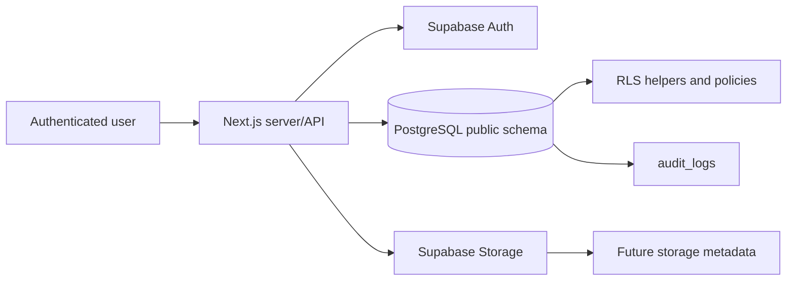
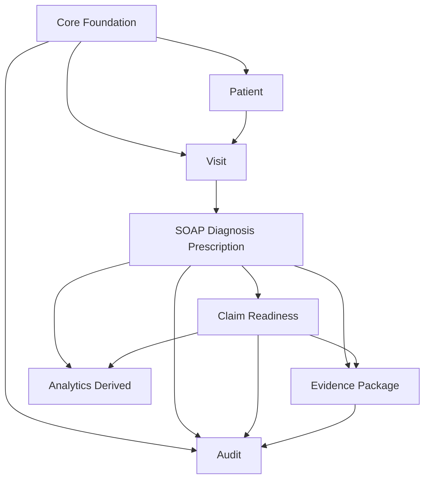
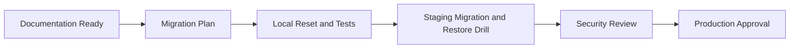
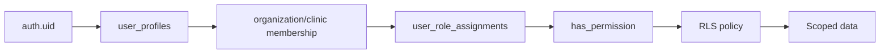
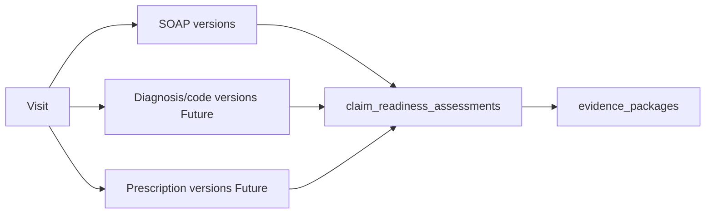
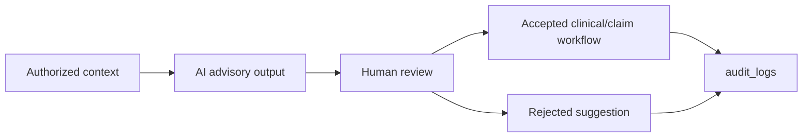
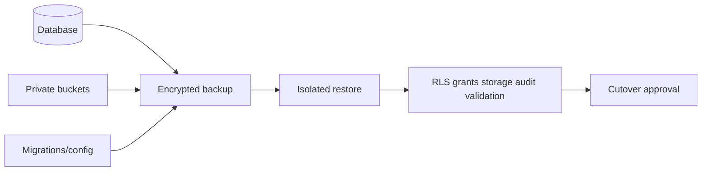

# Database Architecture

## 1. Document Control
Status: Populated for DB-DOC-DATABASE-DESIGN-SYSTEM. Source of truth: migrations `001` through `007`, completed database docs, and repository source inspection. Runtime effect: none.

## 2. Purpose
Creates the top-level database architecture document for Med AI NexSure.

## 3. Scope
Covers current and target architecture for identity, tenancy, RBAC/RLS, clinical, insurance, evidence, audit, AI, storage, integrations, analytics, performance, backup, environments, deployment, and recovery.

## 4. Current-state Architecture
Current state is a Supabase/PostgreSQL schema with tenant-scoped operational tables, RLS helper functions, seeded RBAC, private buckets, clinical and claim readiness tables, audit logs, and many app modules still mock-backed.

## 5. Target-state Architecture
Target state adds professional credential enforcement, canonical permission keys, storage object policies, payer-rule/insurance tables, medical certificate metadata, durable evidence manifests, domain version tables, audit integrity controls, and tested backup/restore.

## 6. Architecture Principles
Auth is separate from application identity. Tenant context is server/database-derived. RLS and grants work together. Clinical data is authoritative over insurance interpretation. AI and analytics are non-authoritative. Audit logs and domain version history are separate.

## 7. System Context

## 8. Trust Boundaries
Browser clients are untrusted for tenant context, roles, professional authority, and clinical finalization. Server actions/API routes validate intent; database RLS enforces tenant/permission checks; storage authorization is separate from table RLS.

## 9. Domain Architecture

## 10. Multi-tenant Architecture
`organization_id` is the tenant boundary; `clinic_id` is the operational care boundary. RLS helpers derive membership and permissions from authenticated user state.

## 11. Organization Boundary
Organizations own clinics, profiles, settings, memberships, roles, and most data scopes. Cross-organization access is denied by default.

## 12. Clinic Boundary
Clinic-scoped data includes patients, visits, clinical records, prescriptions, inventory, claim readiness, evidence, and many audit rows.

## 13. Future Department and Care-team Boundaries
Departments and care teams are Future access partitions. They must refine, not replace, organization/clinic boundaries.

## 14. Identity Architecture
`auth.users` remains authentication source of truth. `user_profiles` remains application identity and authorization join point.

## 15. Authentication Architecture
Supabase Auth provides sessions. Normal browser flows must not use `service_role`.

## 16. Authorization Architecture
Authorization combines active profile, organization/clinic membership, role assignment, permission, professional authority where required, and resource relationship.

## 17. RBAC Architecture
Existing RBAC has `roles`, `permissions`, `role_permissions`, legacy `user_roles`, and current `user_role_assignments`. Permission key normalization is Planned.

## 18. RLS Architecture
Existing helpers include `is_organization_member`, `has_clinic_access`, and `has_permission`. Policies use these helpers with per-table scope.

## 19. Grant Architecture
RLS helper functions are granted to `authenticated` in migration `007`. Post-restore grant validation is required.

## 20. Professional-authority Architecture
Professional credentials are Future. Administrative authority must not imply clinical authority for signing, diagnosis confirmation, prescribing, dispensing, certificate issuance, or overrides.

## 21. Patient Architecture
Patients are PHI-bearing, tenant/clinic scoped, and linked to clinic registrations and visits.

## 22. Visit Architecture
Visits connect patient, clinic, attending user, payer name, clinical status, claim status, risk level, and downstream clinical/claim/evidence records.

## 23. Clinical Documentation Architecture
SOAP has a current record and version history. Signed-state and amendment enforcement are Planned.

## 24. Diagnosis and ICD Architecture
Diagnosis catalogue and visit diagnoses exist. Independent diagnosis/code versioning is Future.

## 25. Prescription and Inventory Architecture
Prescription headers/items and inventory/stock ledgers exist. Dispensing event and reversal architecture is Future.

## 26. Medical Certificate Architecture
Only private `medical-certificates` bucket exists. Certificate metadata, versions, signatures, and export records are Future.

## 27. Insurance and Payer-rule Architecture
Payer-rule application code is mock-backed. Durable payer/coverage/rule-version tables are Future.

## 28. Claim-readiness Architecture
Claim readiness assessments/items exist and are advisory. They consume clinical/evidence/rule inputs and must not own clinical truth.

## 29. Evidence-package Architecture
Evidence package header exists. Items, manifests, verification, exports, clinical document metadata, and storage reconciliation are Future.

## 30. Audit and Versioning Architecture
`audit_logs` captures events; domain version tables preserve state history. High-risk workflows require transaction and audit consistency.

## 31. AI Governance Architecture
Existing AI metadata appears on SOAP and visit diagnoses. Future AI governance records track model, prompt, policy, evidence, suggestion, and human decision.

## 32. Storage Architecture
Private buckets exist. Storage policies and metadata tables are Review Required. Storage paths are not authorization by themselves.

## 33. Integration Architecture
`integration_providers` and `organization_integrations` exist. Integration secrets must use references, not stored raw values.

## 34. Analytics Architecture
Analytics is Future/derived. It reads operational data through tenant-safe aggregation and does not write clinical truth.

## 35. Performance Architecture
Existing indexes support tenant, workflow, dashboard, audit, claim, evidence, and inventory lookups. New indexes require query-plan evidence.

## 36. Backup and Recovery Architecture
Backup/restore strategy covers database, storage, migrations, config, RLS/grants, audit, and clinical version integrity. RPO/RTO are Review Required.

## 37. Environment Architecture
Local and automated test environments are rebuildable. Staging validates migrations/restores. Production requires approved backup, restore, security, and release gates.

## 38. Deployment Architecture

## 39. Failure and Recovery Architecture
Fail closed on high-risk clinical, claim override, export, and audit failures. Use isolated restore for recovery validation.

## 40. Security Architecture
Least privilege, default-deny RLS, minimum necessary access, no frontend-trusted tenant context, no wildcard permissions, no secrets in metadata, and no real PHI in tests.

## 41. Current versus Target Gaps
Gaps: credential enforcement, storage policies, payer-rule schema, certificate schema, clinical document metadata, durable safety alerts, independent diagnosis/code versions, audit immutability, executable SQL tests, and restore drills.

## 42. Compatibility-sensitive Contracts
Permission keys, role assignment tables, enum state values, storage bucket names, free-text source references, Auth/profile linkage, and PostgreSQL/Supabase version assumptions.

## 43. Review Required Decisions
Credential model, canonical permission migration, insurance/payer-rule schema, storage authorization, audit append-only controls, backup RPO/RTO, analytics persistence, and tenant-specific restore.

## Required Architecture Diagrams
### Tenant Authorization Flow

### Clinical-to-Claim Flow

### AI Decision-support Flow

### Backup and Recovery Flow

