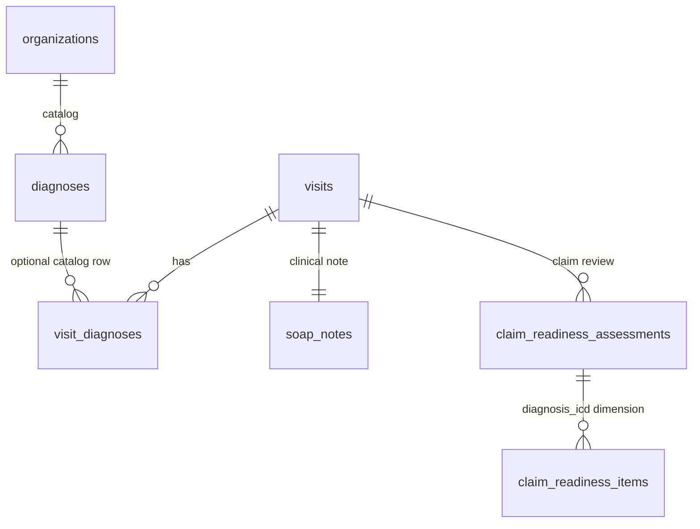

# Diagnosis and ICD Model

## 1. Document Control
Status: Populated for DB-DOC-BATCH-5-CLINICAL. Source of truth: migrations `001`, `003`, `004`, `006`, and `007`. Runtime effect: none.

## 2. Purpose
Defines how clinical diagnoses and code mappings are represented. Clinical diagnosis text and ICD code are distinct concepts.

## 3. Scope
Existing: `diagnoses`, `visit_diagnoses`, `visits`, `soap_notes`, `claim_readiness_assessments`, `claim_readiness_items`, RLS helpers and policies. Future: `diagnosis_versions`, `diagnosis_code_mappings`, `code_systems`, `code_system_versions`, `icd_catalogue`, `diagnosis_ai_suggestions`, `diagnosis_reviews`.

## 4. Current Repository State
`diagnoses` is an organization-scoped diagnosis code catalogue. `visit_diagnoses` stores visit-level diagnosis text, code, type, coding status, source, AI metadata, and human acceptance fields. No separate ICD catalogue, code-system registry, diagnosis review table, or diagnosis version table exists.

## 5. Domain Ownership
Owner: Clinical domain with insurance-readiness consumers. Payer review may flag coding issues but must not overwrite clinical truth.

## 6. Diagnosis versus Code
Existing `visit_diagnoses.diagnosis_text` is clinical text. Existing `diagnosis_code` and optional `diagnosis_id` represent coding. Future mappings may support multiple code systems per diagnosis.

## 7. Diagnosis Entity Model

## 8. Diagnosis Text
Existing: `visit_diagnoses.diagnosis_text text not null`. Classification: Restricted Clinical PHI.

## 9. Primary Diagnosis
Existing: `diagnosis_type` check allows `primary`.

## 10. Secondary Diagnosis
Existing: `diagnosis_type` default is `secondary`.

## 11. Provisional Diagnosis
Proposed state: `provisional`. Existing status closest equivalent is `draft`; no clinical finality status exists.

## 12. Differential Diagnosis Readiness
Existing: `diagnosis_type` allows `differential`.

## 13. Final Diagnosis
Proposed: final diagnosis should be a controlled state requiring professional authority. Existing `coding_status = 'accepted'` means coding acceptance, not clinical finality.

## 14. ICD-10 Readiness
Existing: `diagnoses.code_system text not null default 'ICD-10'`, `diagnosis_code`, and `display_name`.

## 15. ICD-9 Procedure Readiness
Future: supported only if code-system registry and versioned mappings are added.

## 16. Code-system Registry
Future: `code_systems` and `code_system_versions`; currently code system is free text on `diagnoses`.

## 17. Code-system Versioning
Gap: `effective_from` and `effective_to` exist on `diagnoses`, but no authoritative code-system version table exists.

## 18. Diagnosis-to-code Mapping
Existing: `visit_diagnoses.diagnosis_id` optional FK to `diagnoses(id)` plus denormalized `diagnosis_code`. Future: `diagnosis_code_mappings` for many mappings and mapping provenance.

## 19. Mapping Confidence
Existing: `confidence numeric(5,2)` constrained 0-100. It is a review signal, not a calibrated probability.

## 20. Clinical Authority
Review Required: repository has RBAC roles and permissions but no professional credential table. Final diagnosis authority must be validated separately from administrative role assignment.

## 21. Coder Role Readiness
Existing roles include `claim_reviewer`; no dedicated clinical coder role or diagnosis-specific permission exists.

## 22. AI Coding Suggestions
Existing: `source_type` allows `ai`, with `model_name`, `model_version`, `confidence`, `accepted_by`, and `accepted_at`. Future: `diagnosis_ai_suggestions` separates suggestions from accepted diagnosis records.

## 23. Human Acceptance
Existing: `ck_visit_diagnoses_ai_acceptance` requires accepted AI-coded rows to have `accepted_by` and `accepted_at`.

## 24. Human Rejection
Existing `coding_status` allows `rejected`; gap: no rejection reason column.

## 25. Human Override
Proposed: override requires reason, actor, timestamp, original suggestion, and audit event.

## 26. Visit Relationship
Existing: `visit_id uuid not null references visits(id) on delete restrict`; tenant fields are also present.

## 27. SOAP Relationship
Existing relationship is through the visit. No direct SOAP-note FK exists.

## 28. Claim Relationship
Existing: `claim_readiness_items.dimension_code` includes `diagnosis_icd`; claim readiness can flag diagnosis/code completeness.

## 29. Payer-rule Relationship
Future: payer rules should link to validation findings, not directly mutate diagnosis rows.

## 30. Versioning and Amendment
Gap: `visit_diagnoses` has no version table. Proposed `diagnosis_versions` should preserve post-completion changes, entered-in-error history, and amendment reasons.

Canonical versioning is Future:

| Future entity | Contract |
|---|---|
| `diagnosis_versions` | Version diagnosis text, status, primary/secondary designation, author, reviewer, confirmation timestamp, and amendment reason. |
| `diagnosis_code_mappings` | Link a clinical diagnosis version to one or more code mappings without rewriting diagnosis text. |
| `diagnosis_code_mapping_versions` | Version ICD mapping, code system, code-system version, mapping confidence, reviewer, and override reason. |
| `code_systems` | Register code systems such as ICD-10 and ICD-9 procedure coding. |
| `code_system_versions` | Preserve released code-system versions and effective dates. |

Claim assessments and evidence packages must reference immutable diagnosis/code version identifiers used at assessment or package generation time. Code catalogue updates must not retroactively rewrite prior mappings.

## 31. Data Quality
Existing constraints: type in `primary`, `secondary`, `differential`; status in `draft`, `suggested`, `accepted`, `rejected`, `amended`; source in `human`, `ai`, `import`; confidence 0-100.

## 32. Audit Events
Existing `audit_action_type` includes `clinical_review`, `claim_review`, `update`, and `evidence_change`. Proposed diagnosis events: `diagnosis.created`, `diagnosis.icd_mapped`, `diagnosis.confirmed`, `diagnosis.amended`, `diagnosis.entered_in_error`, `diagnosis.ai_accepted`, `diagnosis.ai_rejected`.

## 33. RLS Responsibility
Existing newer policies: `mvp1_visit_diagnoses_select`, `mvp1_visit_diagnoses_insert`, `mvp1_visit_diagnoses_update`, and `mvp1_diagnoses_select`. Visit diagnosis write uses `soap.update`.

## 34. Constraints
`diagnoses`: PK, FK organization, unique `(organization_id, code_system, diagnosis_code)`, effective range check. `visit_diagnoses`: PK, FK visit, optional FK diagnosis, tenant-safe clinic FK to `(organization_id, clinic_id)`, checks listed above.

## 35. Index Strategy
Migration `004` predates `visit_diagnoses`; no explicit diagnosis indexes were found. Proposed indexes: visit diagnosis `(organization_id, clinic_id, visit_id)` and active catalogue `(organization_id, code_system, diagnosis_code) where deleted_at is null`.

## 36. Transactions
Proposed: create diagnosis text, mapping, AI acceptance/rejection, and audit log in one transaction for high-risk state changes.

## 37. Concurrency
Gap: no lock version. Post-completion diagnosis changes require compare-and-update or versioned amendment.

## 38. Failure Handling
RLS, authority, invalid code-system, duplicate catalogue code, or audit failure should abort the transition.

## 39. Future Extensions
`diagnosis_versions`, `diagnosis_code_mappings`, `code_systems`, `code_system_versions`, `icd_catalogue`, `diagnosis_ai_suggestions`, `diagnosis_reviews`, and a coder role.

## 40. Compatibility-sensitive Items
`coding_status` values differ from required clinical states; `soap.update` currently grants diagnosis writes; `diagnoses.code_system` is free text; dot and colon permission formats coexist.

## 41. Review Required Decisions
Canonical diagnosis lifecycle states are standardized in `record-state-machines.md`. Remaining Review Required items: code-system governance source, coder role scope, credential verification source, and migration from existing `coding_status` values.

## Required Diagnosis States
| Required state | Classification | Existing equivalent or gap |
|---|---|---|
| `provisional` | Proposed | Approximate existing `draft` |
| `confirmed` | Proposed | No exact state |
| `amended` | Existing | `coding_status.amended` |
| `ruled_out` | Proposed | No exact state |
| `entered_in_error` | Proposed | No exact state |

## Core Flow Controls
| Flow | Actor | Input | Auth and permission | Authority | Transaction and audit | Failure behavior |
|---|---|---|---|---|---|---|
| Diagnosis creation to ICD mapping to confirmation | Clinician or coder | Visit, text, code | Authenticated; future `clinical.diagnosis.create`, `clinical.coding.assign`, `clinical.diagnosis.confirm` | Clinical confirmation requires verified credential and scope | Insert/update versioned diagnosis and mapping plus audit | No partial confirmation |
| AI coding suggestion to human review | Clinician/coder | AI suggestion, model metadata | Future `clinical.coding.review` or `clinical.coding.override` | Human reviewer | Acceptance/rejection plus audit | AI output remains advisory |

## Decision Closure References
Canonical lifecycle: `record-state-machines.md`.

Canonical permissions: `clinical.diagnosis.read`, `clinical.diagnosis.create`, `clinical.diagnosis.update`, `clinical.diagnosis.confirm`, `clinical.diagnosis.amend`, `clinical.diagnosis.mark_error`, `clinical.coding.read`, `clinical.coding.assign`, `clinical.coding.review`, `clinical.coding.override`.

Terminology: use `confirmed`, not `final`; claim-review corrections to coding do not silently alter clinical diagnosis truth.
