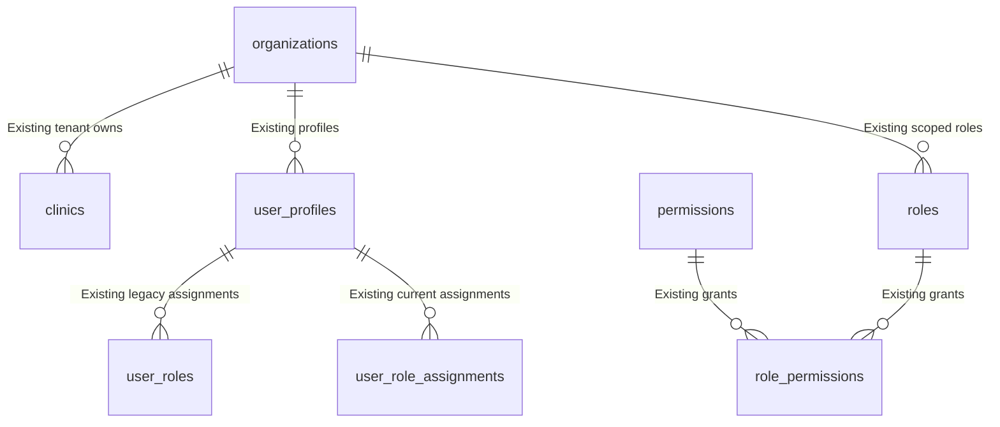
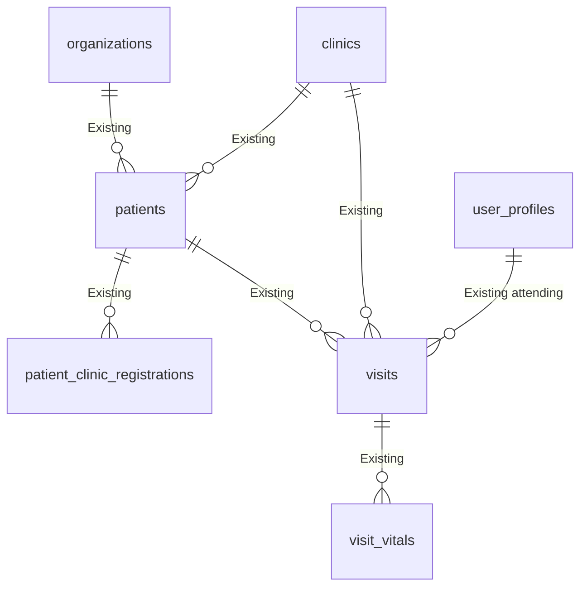
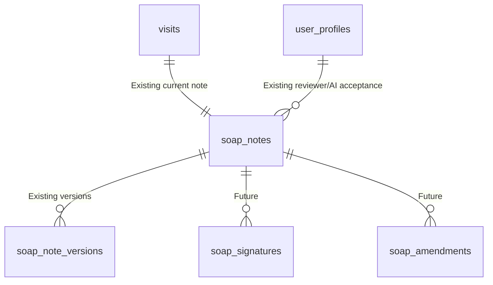
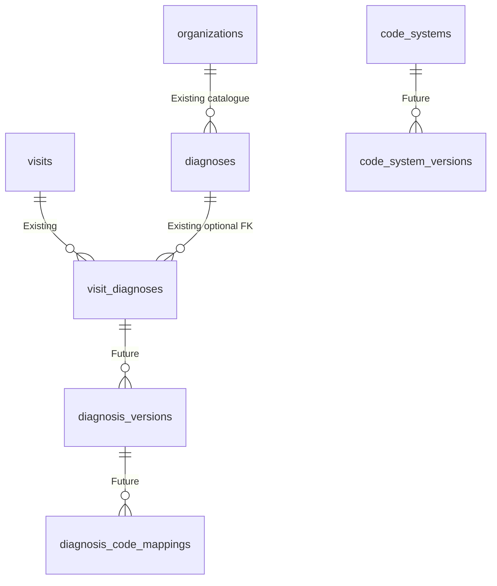
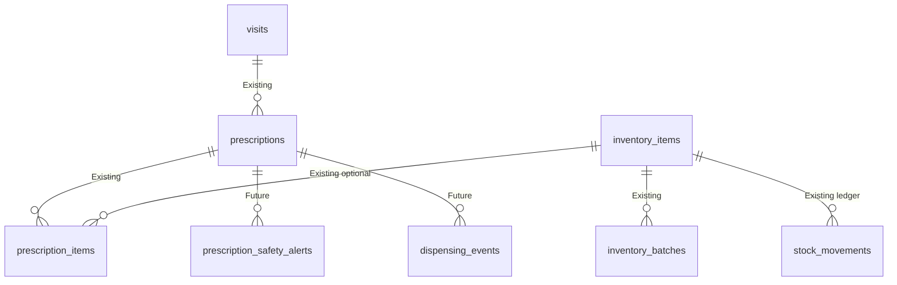
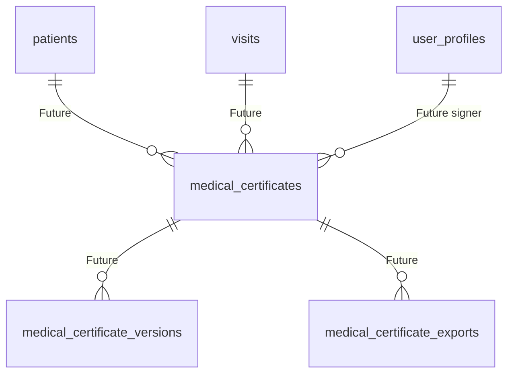
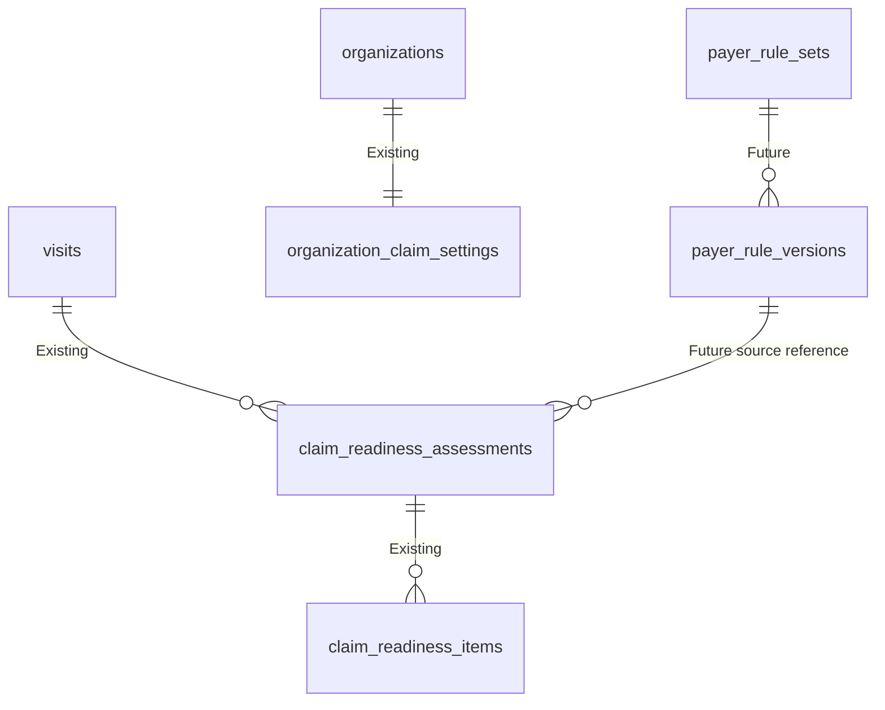
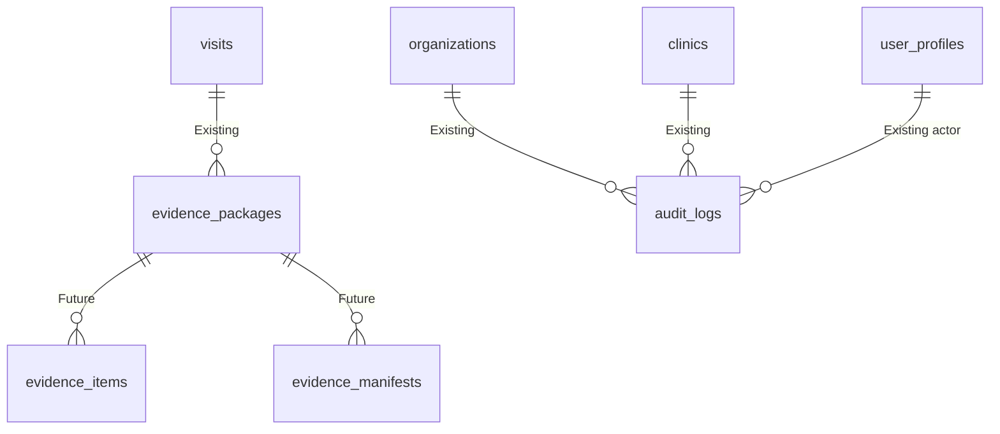
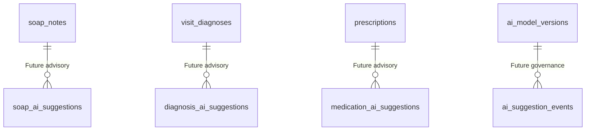

# ERD Overview

## 1. Document Control
Status: Populated for DB-DOC-BATCH-7-ARCHITECTURE. Source of truth: migrations `001` through `007` and completed database domain docs. Runtime effect: none.

## 2. Purpose
Provides the authoritative cross-domain ERD overview for Med AI NexSure, separating implemented relationships from planned and future design.

## 3. Scope
Domains covered: Identity and Authentication, Organization and Clinic, Patient, Visit, SOAP, Diagnosis and ICD, Prescription and Inventory, Medical Certificate, Insurance Coverage, Payer Rules, Claim Readiness, Evidence Package, Audit, AI, Storage, and Analytics.

## 4. ERD Legend
Mermaid relationships show verified database relationships where possible. Future relationships are labeled `Future` in the relationship text.

## 5. Entity Status Legend
Existing = implemented in migrations. Planned = documented design for near-term implementation. Future = not implemented. Review Required = decision not closed. Compatibility Sensitive = implemented or referenced name requiring controlled migration.

## 6. Domain Ownership Notation
Clinical domains own clinical truth. Insurance and claim readiness consume clinical source versions. Audit records events but does not own source state. AI output is advisory.

## 7. Tenant-boundary Notation
Tenant-bound records include `organization_id`; clinic-scoped records include `clinic_id`. Composite tenant-safe FK expectations use `(organization_id, clinic_id)` where implemented or planned.

## 8. Authoritative versus Derived Records
Authoritative: organizations, clinics, patients, visits, SOAP, diagnosis, prescriptions, inventory, audit, claim assessment rows, and evidence package rows. Derived: dashboards, readiness scores, AI suggestions, package summaries, and analytics.

## 9. Existing versus Future Relationships
Future certificate, clinical document, payer-rule, AI governance, analytics, and professional credential relationships are shown as Future. Do not implement from this document without migrations.

## 10. Core Foundation ERD

## 11. Patient and Visit ERD

## 12. SOAP and Clinical ERD

## 13. Diagnosis and ICD ERD

## 14. Prescription and Inventory ERD

## 15. Medical Certificate ERD

## 16. Insurance and Claim Readiness ERD

## 17. Evidence and Audit ERD

## 18. AI Governance ERD

AI suggestions are not authoritative clinical truth until an authorized human accepts or rejects them through governed workflow.

## 19. Storage Relationships
Existing private buckets: `organization-assets`, `patient-documents`, `evidence-files`, `medical-certificates`, `integration-files`. Future metadata rows should link bucket/object path/checksum to `clinical_documents`, `evidence_items`, certificate exports, or integration logs.

## 20. Analytics and Derived-data Relationships
Analytics and dashboards are derived from visits, claims, evidence, audit, inventory, and payer-rule records. Future summary tables or materialized views must preserve tenant filters and must not become clinical truth.

## 21. Cross-domain Relationships
Visit is the central clinical-to-insurance bridge. Claim readiness reads clinical and evidence versions. Evidence packages snapshot exact source versions. Audit logs reference targets by table and record ID but are not version tables.

## 22. Cardinality Rules
One organization has many clinics and profiles. One patient has many visits. One visit has one current SOAP note and many diagnoses, prescriptions, assessments, and evidence packages. One assessment has many dimension items.

## 23. Tenant-safe Composite Relationships
Existing tenant-safe clinic FK exists for clinic detail tables, memberships, registrations, vitals, diagnoses, claim readiness, and evidence packages. Review Required: some base clinical tables use single-column FKs plus tenant columns and need composite FK validation in future migrations.

## 24. High-risk Relationship Notes
Signing, dispensing, certificate issuance, export, readiness override, and professional credential decisions need permission, professional authority, source version, and audit consistency.

## 25. Compatibility-sensitive Relationships
`user_roles` versus `user_role_assignments`; colon versus dot permissions; existing enum states versus canonical state machines; free-text `rule_set_version`, `evidence_reference`, and `storage_reference`; future document tables referenced by UI but absent in migrations.

## 26. Review Required Decisions
Credential schema, payer-rule schema, clinical document metadata, storage object policies, analytics materialization, composite FK retrofits, and canonical migration from existing states to documented future states.

## Architecture Flow Explanations
| Flow | Source domain | Target domain | Owner | Identifiers | Tenant context | Dependency | Security boundary | Audit | Failure impact |
|---|---|---|---|---|---|---|---|---|---|
| Core identity and tenant | Auth/profile | Organization/clinic | Identity | `auth.users.id`, `user_profiles.id` | organization/clinic membership | read/write RBAC | RLS helpers | permission changes | access denied or overbroad access |
| Patient to visit | Patient | Visit | Clinical ops | patient UUID, visit UUID, business numbers | org/clinic | visit writes depend on patient | patient PHI RLS | create/update | invalid encounter |
| Visit to clinical records | Visit | SOAP/diagnosis/prescription | Clinical | visit UUID | org/clinic | clinical records depend on visit | clinical permissions | clinical review | incomplete record |
| SOAP to diagnosis/prescription | SOAP | Diagnosis/prescription | Clinical | SOAP version, diagnosis, prescription | org/clinic | plan/assessment context | professional authority | sign/amend/order | unsafe clinical truth |
| Visit to claim readiness | Visit | Claim readiness | Insurance | visit UUID, assessment version | org/clinic/claim case | source versions | claim permissions | claim_review | stale readiness |
| Clinical records to evidence | Clinical | Evidence | Evidence | source version IDs | org/clinic/claim case | immutable source references | minimum necessary | evidence_change/export | bad package |
| Versions to audit | Domain versions | Audit | Domain + compliance | record/version/correlation ID | org/clinic | transaction consistency | audit.view | audit event | untraceable change |
| Storage to metadata | Storage | Evidence/cert/docs | Evidence/storage | bucket/object/checksum | org/clinic path metadata | DB row and object | storage policy | export/download | orphan or leak |
| Operations to analytics | Operational | Analytics | Analytics | aggregate keys | tenant scoped | derived reads | aggregate-first | dashboard_viewed | misleading dashboard |
| Backup to restore | Backup | Restored env | Operations | snapshot/migration/storage IDs | environment/tenant | restore runbook | privileged ops | restore audit | data loss/reintro |
| Docs to QA gate | Docs | Release QA | QA | requirement IDs | n/a | checklist evidence | no code bypass | sign-off | release blocked |
