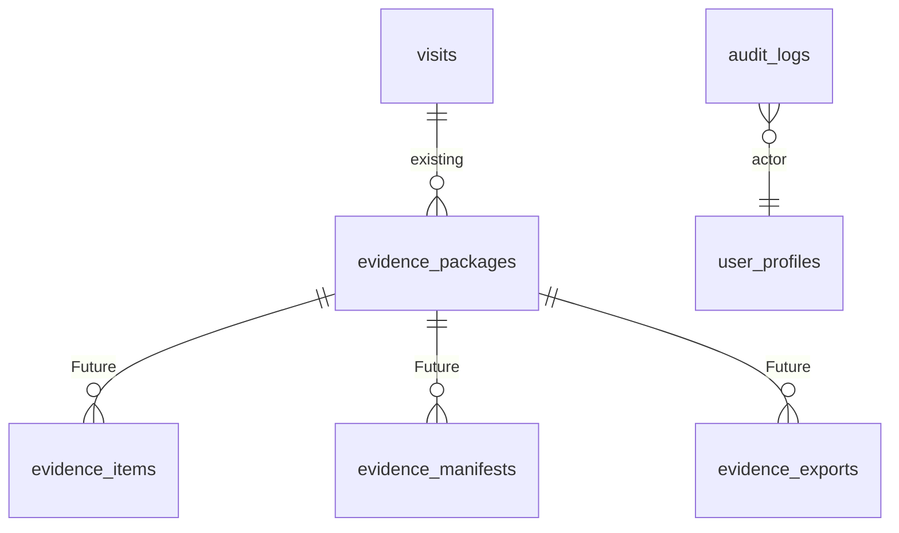

# Evidence Document Model

## 1. Document Control
Status: Populated for DB-DOC-BATCH-6-INSURANCE. Source of truth: migrations `006` and `007`, evidence package feature code, clinical model docs, and storage bucket setup. Runtime effect: none.

## 2. Purpose
Defines evidence documents and packages for claim readiness. Evidence references authoritative source records; it does not silently modify clinical source data.

## 3. Scope
Existing: `evidence_packages`, private storage buckets `patient-documents`, `evidence-files`, `medical-certificates`, claim readiness tables, `audit_logs`, mock-backed evidence package service/types. Future: `clinical_documents`, `evidence_items`, `evidence_package_versions`, `evidence_manifests`, `evidence_verifications`, `evidence_exports`.

## 4. Current Repository State
`evidence_packages` exists as a visit-scoped package header with version, status, completeness score, storage reference, checksum, generated/approved actors, audit fields, and soft delete. `clinical_documents` is not implemented. The evidence package app feature is mock-backed and includes package statuses, validation items, export history, AI recommendation, and timeline.

## 5. Domain Ownership
Owner: Insurance/evidence domain for package assembly and verification. Clinical source records remain owned by their clinical domains.

## 6. Evidence versus Source Record
Evidence is a claim-case-scoped reference or package snapshot. It must not overwrite SOAP, diagnosis, prescription, certificate, or patient source records.

## 7. Evidence Entity Model

## 8. Clinical-document Relationship
Future `clinical_documents` should store document metadata linked to patients, visits, storage objects, document type, verification, and audit. It is not implemented.

## 9. Evidence-package Relationship
Existing `evidence_packages.visit_id` references `visits(id)` and unique `(visit_id, package_version)` preserves package versions.

## 10. Document Type
Future document type values should cover SOAP excerpt, diagnosis/ICD, prescription, medical certificate, consent, lab, radiology, referral, claim summary, and cost justification.

## 11. Source
Existing app types include sources: `clinician`, `nurse`, `pharmacist`, `ai`, `system`, `external_document`. Future database rows should keep source type and source system.

## 12. Source Version Reference
Planned: each evidence item references immutable source versions such as `soap_note_versions.id`, diagnosis version, code mapping version, prescription version, certificate version, or uploaded document version.

## 13. Verification Status
Existing app statuses include `complete`, `review_required`, `missing`, `blocked`, and `not_applicable`. Future database verification should preserve actor, timestamp, method, evidence hash, and reason.

## 14. Completeness Status
Existing `evidence_packages.completeness_score numeric(5,2)` is constrained 0-100; `package_status` supports `draft`, `review_needed`, `complete`, `approved`, `submitted`, and `superseded`.

## 15. Storage Object Relationship
Existing: `storage_reference text` and private buckets. Future metadata must include bucket, object path, content type, size, checksum, and retention classification. Signed URLs must be short-lived.

## 16. Metadata Contract
Generic metadata must not contain unrestricted PHI, secrets, duplicated signed clinical truth, private keys, raw identity documents, or access tokens. Allowed metadata should be schema-versioned, size-limited, redacted, and validated server-side.

## 17. Integrity Hash
Existing `evidence_packages.checksum text`. Future item-level and manifest-level hashes should cover exact source versions and exported files.

## 18. Manifest
Future `evidence_manifests` records exact evidence items, source version IDs, package version, checksum, export format, and generation policy version.

## 19. Versioning
Existing `package_version integer default 1` and unique `(visit_id, package_version)`. Finalized packages are immutable; regeneration creates a new package version.

## 20. Package Finalization
Existing statuses include `approved` and `submitted`. Future finalization should freeze source references, manifest, storage reference, checksum, and approval actor.

## 21. Regeneration
Regeneration must create a new package version and preserve prior versions. It must not overwrite exported package history.

## 22. Claim-case Scope
Existing scope is visit-based. Future claim-case tables should scope claim reviewer access to a specific claim case and minimum necessary evidence.

## 23. Access Restrictions
Existing RLS `mvp1_evidence_select` uses `claim.view`. No evidence insert/update policies exist in migration `007`; package creation/finalization workflow is Planned.

## 24. Export and Download
Existing app service returns `auditAction: "export_requested"` for export. Future `evidence_exports` must record actor, reason/purpose, object reference, checksum, destination, timestamp, and audit correlation ID.

## 25. Audit Events
Existing audit enum includes `evidence_change` and `export`. Proposed events: `evidence.item_linked`, `evidence.verified`, `evidence.package_finalized`, `evidence.package_regenerated`, `evidence.export_requested`, `evidence.export_completed`, `evidence.export_blocked`.

## 26. Retention
Evidence package rows have soft delete fields. Finalized/exported package manifests and export logs should remain traceable according to legal and payer retention rules.

## 27. RLS Responsibility
Database rows and storage objects both require authorization. RLS must not trust frontend-provided tenant context; storage object policies are not implemented and remain Review Required.

## 28. Constraints
Existing constraints: PK, tenant-safe clinic FK, visit FK, unique visit/package version, completeness score 0-100, package status check.

## 29. Index Strategy
Existing: `idx_evidence_packages_visit` on `(visit_id, package_version desc)` where `deleted_at is null`. Planned: package worklist indexes on org/clinic/status/generated date after real query-plan validation.

## 30. Orphan-file Reconciliation
Planned: periodic reconciliation compares storage objects with database metadata and marks missing DB row, missing object, checksum mismatch, or orphaned object for review.

## 31. Transactions
Package finalization should write package version, item references, manifest, checksum, storage reference, and audit in one transaction after storage object integrity is verified.

## 32. Idempotency
Export, finalization, and regeneration require idempotency keys to avoid duplicate packages or duplicate exports on retry.

## 33. Failure Handling
If storage upload, hash validation, authorization, manifest creation, or audit fails, the package must not become finalized/exported.

## 34. Future Extensions
`clinical_documents`, `evidence_items`, `evidence_package_versions`, `evidence_manifests`, `evidence_verifications`, `evidence_exports`, storage object policies, and reconciliation jobs.

## 35. Compatibility-sensitive Items
Existing DB package statuses differ from app `PackageStatus`; `clinical_documents` is referenced in docs but absent; `storage_reference` is free text; bucket names are contract-sensitive.

## 36. Review Required Decisions
Clinical document schema, evidence item status vocabulary, storage path convention, signed URL expiry, export permission key, reconciliation cadence, manifest hash algorithm, and claim-case scope model.

## Object Classification
| Classification | Items |
|---|---|
| Existing | `evidence_packages`, private storage buckets, `mvp1_evidence_select`, evidence mock service/types |
| Planned | manifest, finalized package immutability, export audit, orphan reconciliation |
| Future | `clinical_documents`, `evidence_items`, `evidence_package_versions`, `evidence_manifests`, `evidence_verifications`, `evidence_exports` |
| Review Required | storage object policies, metadata schema, claim-case scope |
| Compatibility Sensitive | bucket names, `package_status`, `storage_reference`, app statuses |

## Batch 6 Flow Notes
| Flow | Actor | Input | Permission | Context | Source versions | Transaction | State transition | Audit | Failure behavior | Output |
|---|---|---|---|---|---|---|---|---|---|---|
| Evidence collection | Clinical/claim user | visit and sources | `claim.view` plus planned write | org/clinic/visit | source record versions | item link + audit | missing to linked | `evidence.item_linked` | no package change | evidence item |
| Evidence verification | claim reviewer | evidence item | planned verify | claim-case | item/source version | verification + audit | review to complete/blocked | `evidence.verified` | item remains pending | verification result |
| Package finalization | claim reviewer | complete evidence | planned finalize | claim-case | manifest versions | package + manifest + audit | draft to approved/submitted | `evidence.package_finalized` | no finalized package | package version |
| Package regeneration | system/reviewer | source changes | planned regenerate | claim-case | new source versions | new package version | prior to superseded | `evidence.package_regenerated` | prior version remains | regenerated package |
| Package export | authorized user | finalized package | planned export | claim-case | manifest version | export row + audit | approved to exported app state | `export` | export blocked | short-lived export |
