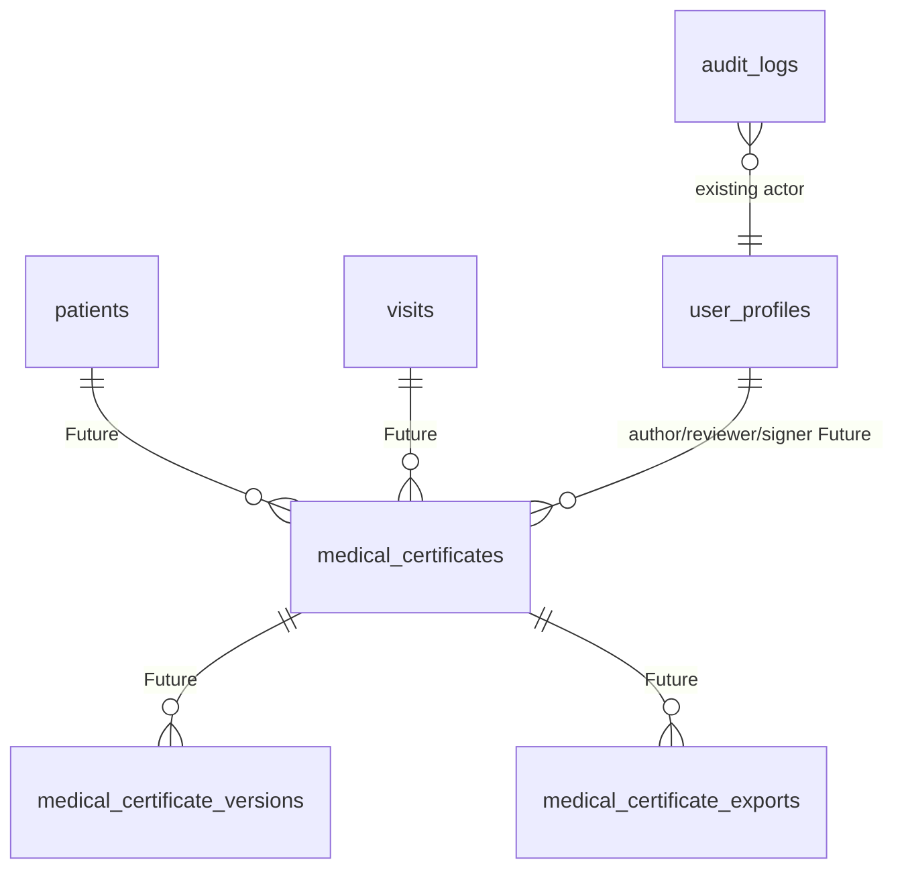

# Medical Certificate Model

## 1. Document Control
Status: Populated for DB-DOC-BATCH-5-CLINICAL. Source of truth: migrations `001` through `007` and existing documentation. Runtime effect: none.

## 2. Purpose
Defines future-ready medical-certificate drafting, review, issuance, revocation, supersession, export, verification, and audit.

## 3. Scope
Existing supporting objects: `organizations`, `clinics`, `patients`, `visits`, `user_profiles`, `audit_logs`, Supabase Storage bucket `medical-certificates`. Future entities: `medical_certificates`, `medical_certificate_versions`, `medical_certificate_signatures`, `medical_certificate_templates`, `medical_certificate_exports`.

## 4. Current Repository State
No `medical_certificates` table or certificate-specific RLS policy was found in migrations. Migration `007` creates a private Supabase Storage bucket named `medical-certificates` when the `storage` schema exists. Patient-document UI types include `medical_certificate` category, but database metadata is not implemented.

## 5. Domain Ownership
Owner: Clinical domain with compliance oversight. Administrative authority does not grant certificate-signing authority.

## 6. Certificate Entity Model

## 7. Certificate Number Strategy
Proposed: use UUID PK plus separate business certificate number generated by a concurrency-safe sequence or allocator. Do not use `MAX()+1`.

## 8. Patient Relationship
Future `medical_certificates.patient_id` should reference `patients(id)` and include tenant-safe organization and clinic context.

## 9. Visit Relationship
Future `visit_id` should reference `visits(id)` when certificate is visit-derived. It should not allow cross-tenant patient/visit mismatches.

## 10. Clinical Findings Reference
Future references should point to SOAP versions or evidence references, not copy unrestricted clinical truth into certificate metadata.

## 11. Diagnosis Reference
Future references should point to controlled diagnosis records or versions. Claim coding changes must not silently rewrite issued certificates.

## 12. Intended Purpose
Future field should classify purpose, for example work absence, school absence, travel, insurance support, or referral. Classification values require product/legal review.

## 13. Issue Date
Future `issued_at timestamptz` should use Asia/Bangkok presentation while preserving `timestamptz` storage.

## 14. Validity Period
Future `valid_from` and `valid_until` should be constrained so end is not before start.

## 15. Work or Activity Restriction Readiness
Future structured restrictions should avoid free-text overexposure and support minimum necessary disclosure.

## 16. Author
Future author fields should reference `user_profiles(id)` and preserve draft author history.

## 17. Reviewer
Future reviewer fields should reference `user_profiles(id)` and be separate from signer.

## 18. Signer
Future signer fields or `medical_certificate_signatures` must identify the signing professional.

## 19. Professional Authority
Review Required: no professional credential table exists. Issuance must validate active professional authority separate from RBAC roles.

## 20. Signature Metadata
Future signature metadata may include signer id, signed hash, timestamp, signing method, and certificate version. It must not store private signing keys or secrets.

## 21. Template Versioning
Future `medical_certificate_templates` should preserve template version and language used at issuance.

## 22. Draft Lifecycle
Required state `draft` is Proposed for certificates because no table exists.

## 23. Issuance
Required state `issued` is Proposed. Issuance requires authenticated actor, signing permission, professional authority, immutable issued content hash, storage reference, and audit.

## 24. Revocation
Required state `revoked` is Proposed. Revocation must retain issued history and require reason.

## 25. Supersession
Required state `superseded` is Proposed. Supersession links old and replacement certificate.

## 26. Reissue
Future reissue must be idempotent and versioned, not a silent overwrite.

## 27. Controlled Correction
Future corrections use revocation, supersession, or versioned reissue. Issued certificates cannot be edited in place.

## 28. Export and Download
Existing audit action enum has `export`. Future `medical_certificate_exports` should record actor, target, purpose, storage object, checksum, and timestamp.

## 29. Verification Readiness
Future verification should expose minimum necessary certificate validity metadata only.

## 30. QR or Public-verification Readiness
Future QR code should contain an opaque token or URL, not unrestricted PHI.

## 31. Privacy Constraints
Certificate content is Restricted Clinical PHI. Public verification must not expose diagnosis, full SOAP content, or unrelated patient history.

Future metadata must use first-class typed columns or normalized references for signer identity, professional credential, issue date, validity period, certificate purpose, diagnosis reference, visit reference, revocation status, superseded certificate reference, template version, and signature state.

JSONB is allowed only for non-authoritative rendering options, template-specific optional display fields, redacted external verification response snapshots, and forward-compatible non-critical attributes. Any JSONB field must define allowed keys, prohibited keys, schema version, validation responsibility, sensitivity classification, size limits, indexing decision, and audit treatment. Prohibited JSONB content: private keys, access tokens, unrestricted PHI copies, raw identity documents, and full signed certificate content duplicated in generic metadata.

## 32. Audit Events
Existing audit table can record target table and record id. Proposed events: `certificate.drafted`, `certificate.reviewed`, `certificate.issued`, `certificate.exported`, `certificate.revoked`, `certificate.superseded`, `certificate.reissued`, `certificate.entered_in_error`.

## 33. RLS Responsibility
No certificate table policy exists. Future RLS must use organization, clinic, patient/visit relationship, minimum necessary roles, and specific permissions such as `certificate.view`, `certificate.create`, `certificate.issue`, `certificate.revoke`, and `certificate.export`.

## 34. Constraints
Future constraints: UUID PK, tenant-safe FKs, unique certificate number per organization, status check, validity range check, required issue/signature fields when issued, immutable issued version hash.

## 35. Index Strategy
Future indexes: `(organization_id, clinic_id, patient_id)`, `(organization_id, certificate_number)`, `(visit_id)`, `(status, issued_at)`, and active soft-delete partial indexes.

## 36. Transactions
Issuance transaction should allocate number, create immutable version, write signature metadata, write storage reference/hash, update status, and insert audit log atomically.

## 37. Concurrency
Certificate number generation must be sequence-backed or allocator-backed and protected from duplicate issue on concurrent requests.

## 38. Idempotency
Future issuance/export APIs should use idempotency keys so retries do not issue duplicate certificates.

## 39. Failure Handling
If signing authority, number allocation, storage write, hash verification, RLS, or audit fails, issuance must fail without a partially issued certificate.

## 40. Retention
Issued, revoked, superseded, and entered-in-error certificates should remain traceable according to retention policy. Soft deletion of issued records is Review Required.

## 41. Future Extensions
`medical_certificates`, `medical_certificate_versions`, `medical_certificate_signatures`, `medical_certificate_templates`, `medical_certificate_exports`, public verification tokens, certificate-specific permissions, and storage object policies.

## 42. Compatibility-sensitive Items
`medical-certificates` storage bucket name, proposed certificate number format, proposed status enum, future storage path contract, and patient-document category `medical_certificate`.

## 43. Review Required Decisions
Canonical certificate lifecycle states are standardized in `record-state-machines.md`. Remaining Review Required items: legal certificate template content, signer credential source, public verification data minimization, retention period, revocation authority, export purpose logging, certificate number format, and exact typed metadata columns.

## Required Certificate States
| State | Classification | Notes |
|---|---|---|
| `draft` | Future | Draft content before review |
| `under_review` | Future | Separate review authority |
| `issued` | Future | Immutable signed record |
| `revoked` | Future | Historical record retained |
| `superseded` | Future | Replacement issued |
| `expired` | Future | Derived or persisted state |
| `entered_in_error` | Future | Traceable correction |

## Key Flow Controls
| Flow | Actor | Input | Auth and permission | Authority | Transaction and audit | Failure behavior |
|---|---|---|---|---|---|---|
| Draft to review to issue | Clinician/signer | Patient, visit, template, findings | `clinical.medical_certificate.create`, `clinical.medical_certificate.review`, `clinical.medical_certificate.issue` | Verified non-expired signing credential and scope | Allocate number + sign + audit | No issued record on failure |
| Issued to revoke, supersede, or reissue | Signer/compliance | Issued certificate and reason | `clinical.medical_certificate.revoke`, `clinical.medical_certificate.reissue` | Professional or compliance credential/scope | Status/version/export audit | Historical issued record retained |

## Decision Closure References
Canonical lifecycle: `record-state-machines.md`.

Canonical permissions: `clinical.medical_certificate.read`, `clinical.medical_certificate.create`, `clinical.medical_certificate.review`, `clinical.medical_certificate.issue`, `clinical.medical_certificate.revoke`, `clinical.medical_certificate.reissue`, `clinical.medical_certificate.export`.

Professional authority enforcement is Planned and depends on Future credential entities. The current repository only has the private `medical-certificates` storage bucket; it does not implement certificate metadata, certificate RLS, certificate export logging, or public verification.
