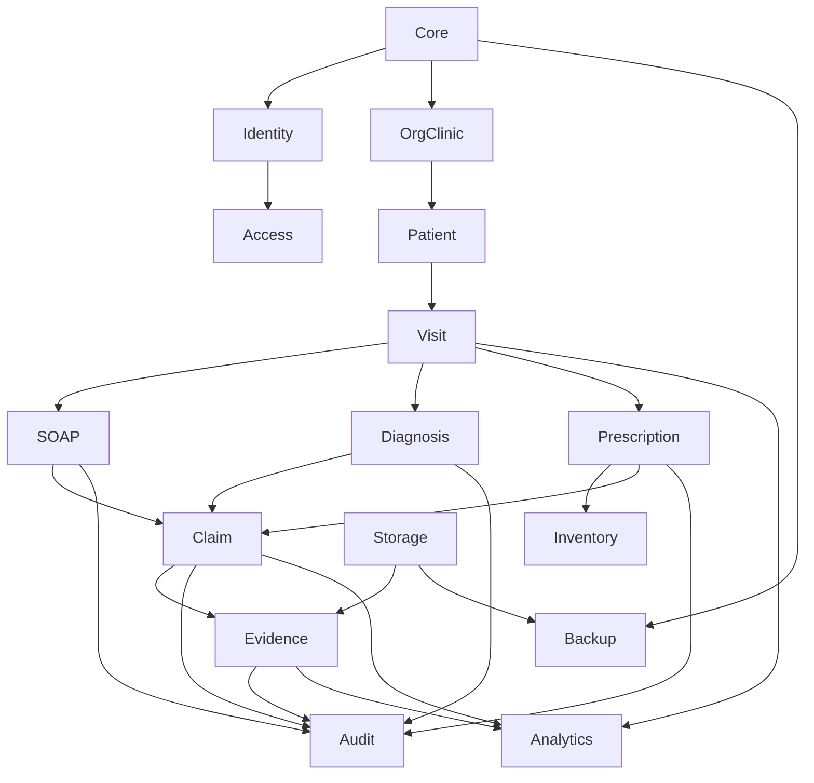

# Module Dependency

## 1. Document Control
Status: Populated for DB-DOC-DATABASE-DESIGN-SYSTEM. Source of truth: completed database docs and migrations `001` through `007`. Runtime effect: none.

## 2. Purpose
Defines authoritative module dependencies, implementation order, data ownership, failure impact, and prohibited coupling.

## 3. Scope
Modules: Core Foundation, Identity and Authentication, User and Access Management, Organization and Clinic, Patient, Visit, SOAP, Diagnosis and ICD, Prescription, Inventory and Dispensing, Medical Certificate, Insurance Coverage, Payer Rules, Claim Readiness, Evidence Package, Audit and Compliance, AI Clinical, Executive Analytics, Economic Intelligence, Integration, Storage, Backup and Recovery, Observability.

## 4. Dependency Principles
One domain owns each authoritative business record. Cross-domain writes require an approved workflow, server boundary, RPC, or transaction. Claim Readiness reads clinical data but cannot overwrite clinical truth. Evidence references source versions and cannot alter them. Analytics is derived. AI writes advisory artifacts only. Storage paths are not authorization. Audit is append-oriented and cannot be mutated by normal domains.

## 5. Module Catalogue
| Module | Purpose | Status | Authoritative entities | Upstream | Downstream | Release order | Review Required |
|---|---|---|---|---|---|---|---|
| Core Foundation | tenant/RBAC/RLS base | Existing/Compatibility Sensitive | orgs, clinics, roles, permissions | none | all | 1 | permission normalization |
| Identity and Authentication | auth identity | Existing | `auth.users`, `user_profiles` | Core | all user workflows | 1 | profile lifecycle |
| User and Access Management | memberships and assignments | Existing/Compatibility Sensitive | memberships, role assignments | Identity/Core | RLS/RBAC | 1 | legacy retirement |
| Organization and Clinic | tenant/care boundary | Existing | organizations, clinics, settings | Core | all scoped records | 1 | composite FKs |
| Patient | PHI identity | Existing | patients, registrations | Core, org/clinic | Visit, clinical | 2 | patient numbers |
| Visit | encounter | Existing | visits, vitals | Patient | clinical, claim | 2 | history table |
| SOAP | clinical documentation | Existing/Planned | SOAP notes/versions | Visit | diagnosis, claim, evidence | 3 | signing |
| Diagnosis and ICD | diagnosis/coding | Existing/Future | diagnoses, visit_diagnoses | Visit/SOAP | claim/evidence | 4 | code versions |
| Prescription | medication orders | Existing/Future | prescriptions/items | Visit/clinical | inventory, claim | 5 | verification |
| Inventory and Dispensing | stock ledger | Existing/Future | inventory, batches, movements | Prescription | pharmacy analytics | 5 | atomic dispensing |
| Medical Certificate | certificates | Future | certificate entities | Patient/Visit/Clinical | evidence/storage | 6 | legal/signing |
| Insurance Coverage | policy/coverage | Future | coverage entities | Patient/Visit | payer/claim | 7 | payer contracts |
| Payer Rules | rule versions | Future | payer rule sets/versions | Insurance | claim readiness | 7 | approval model |
| Claim Readiness | advisory score | Existing/Planned | assessments/items | Clinical/Payer/Evidence | evidence/dashboard | 8 | source refs |
| Evidence Package | evidence package | Existing/Future | evidence_packages, Future items | Clinical/Claim/Storage | export/audit | 9 | storage policies |
| Audit and Compliance | traceability | Existing/Planned | audit_logs, settings versions | all high-risk | compliance/QA | spans all | append-only |
| AI Clinical | advisory support | Existing metadata/Future | AI metadata/suggestions | authorized data | clinical/claim | after governance | model governance |
| Executive Analytics | aggregate views | Future | derived summaries | operational domains | executives | after source domains | materialization |
| Economic Intelligence | cost indicators | Future | cost/economic summaries | visits/claims | analytics/claims | after claims | schema |
| Integration | external providers | Existing/Future | providers/integrations | core/config | payer/storage/audit | after core | secrets |
| Storage | private files | Existing buckets/Future policies | buckets, Future metadata | core/evidence | docs/evidence/certs | before exports | object RLS |
| Backup and Recovery | resilience | Planned | backup evidence | DB/storage/config | production gate | before prod | RPO/RTO |
| Observability | quality/performance | Future | logs/metrics | all modules | QA/ops | before prod | tooling |

## 6. Upstream Dependency Matrix
| Module | Upstream dependencies |
|---|---|
| Patient | Core, Organization, Clinic, Identity |
| Visit | Patient, Organization, Clinic, User Profiles |
| SOAP | Visit, User Profiles, RBAC/RLS |
| Diagnosis and ICD | Visit, SOAP context, Diagnosis catalogue |
| Prescription | Visit, User Profiles, Inventory optional |
| Claim Readiness | Visit, SOAP, Diagnosis/ICD, Prescription, Evidence, Payer Rules Future |
| Evidence Package | Visit, Clinical versions, Claim Readiness, Storage |
| Analytics | Operational domains, RLS-safe aggregation |
| Backup | Database, Storage, Migrations, Configuration |

## 7. Downstream Consumer Matrix
| Source module | Consumers |
|---|---|
| Core | all modules |
| Patient/Visit | clinical, claim, evidence, analytics |
| SOAP/Diagnosis/Prescription | claim readiness, evidence, audit, analytics |
| Claim Readiness | evidence package, dashboards |
| Evidence Package | export, audit, payer workflows |
| Audit | compliance, QA, incident response |

## 8. Read Dependency Matrix
| Reader | May read | Boundary |
|---|---|---|
| Claim Readiness | clinical/evidence/rule versions | claim-case scoped |
| Evidence Package | source clinical versions and storage metadata | minimum necessary |
| AI Clinical | permitted patient/visit/clinical context | invoking user's authorization |
| Analytics | operational data | aggregate-first, tenant scoped |
| Audit/Compliance | audit rows and target metadata | audit permission |

## 9. Write Dependency Matrix
| Writer | May write | Control |
|---|---|---|
| Clinical modules | owned clinical records | clinical permissions/professional authority |
| Claim Readiness | assessment/items only | claim permissions |
| Evidence Package | evidence/package records only | evidence workflow and storage policy |
| Analytics | derived summaries only | no source mutation |
| Audit | audit events | append-only planned |

## 10. Prohibited Dependency Matrix
| Prohibited coupling | Reason |
|---|---|
| Claim Readiness writes SOAP/diagnosis/prescription | insurance cannot own clinical truth |
| Evidence Package edits source clinical records | evidence references versions only |
| AI writes final clinical truth | AI advisory only |
| Analytics updates operational records | analytics derived |
| Browser supplies trusted tenant scope | server/database must derive scope |
| Storage path grants access by itself | storage policy required |
| Normal domains update/delete audit history | audit integrity |

## 11. Migration Dependency Matrix
| Migration dependency | Required order |
|---|---|
| Core schema before RBAC/RLS | `001` then `002`/`003` |
| Indexes after tables | `004` after core tables |
| Tenant identity before composite clinic FKs | `005` before later tenant-safe tables |
| Clinical/claim settings before policies | `006` before related `007` policies |
| Future certificates/payer/evidence items | after credential, permission, and storage decisions |

## 12. Security Dependency Matrix
| Module | Authorization | RLS | Grants | Audit | Storage |
|---|---|---|---|---|---|
| Core/RBAC | role.assign/user invite | required | helper execute | permission_change | none |
| Clinical | clinical permissions + professional authority Future | required | helper execute | clinical_review | documents Future |
| Prescription | prescription permissions + professional authority | required | helper execute | clinical_review/update | none |
| Claim/Evidence | claim.view/review; future export | required | helper execute | claim/evidence/export | storage policies Future |
| Audit | audit.view | required | insert/select only | self-evident | exports Future |

## 13. Test Dependency Matrix
| Module | Tests |
|---|---|
| Core | migration reset, RBAC matrix, RLS helper grants |
| Patient/Visit | PHI isolation, business identifiers, status transitions |
| Clinical | versioning, AI acceptance, professional authority negative tests |
| Claim/Evidence | advisory status, source version refs, export authorization |
| Storage | private bucket, signed URL, object policy, reconciliation |
| Backup | restore drill, RLS/grant/storage validation |

## 14. Failure-impact Matrix
| Failure | Impact | Fallback |
|---|---|---|
| RLS helper failure | broad access denial or exposure risk | fail closed, block release |
| Audit failure on high-risk action | untraceable mutation | rollback transaction |
| Storage policy absent | file exposure risk | disable export/download |
| Claim source stale | incorrect readiness | preserve previous assessment, recalculate |
| Analytics stale | misleading dashboard | show stale marker or disable |
| Restore mismatch | data loss/integrity issue | keep isolated, no cutover |

## 15. Critical Path
Core isolation -> Patient/Visit -> Clinical truth/versioning -> Professional authority -> Claim readiness source references -> Evidence storage policies -> Audit integrity -> QA tests -> Backup/restore -> production promotion.

## 16. Circular Dependency Risks
Claim readiness needs clinical source versions while clinical screens may show readiness status; resolve with read-only readiness display. Evidence packages need claim readiness but claim readiness scores evidence completeness; resolve with versioned recalculation. Audit depends on all domains but domains depend on audit for high-risk commit; resolve with transactional audit insert and fail-closed policy. Backup restores storage and DB together; resolve with reconciliation step.

## 17. Integration Boundaries
Integration modules may read approved exports or write inbound staging records only through controlled workflows. They must not bypass RLS, store raw secrets, or mutate clinical truth directly.

## 18. Release Ordering
Release order follows roadmap phases. High-risk clinical, AI, evidence export, payer-rule activation, and production promotion require security and QA sign-off before release.

## 19. Compatibility-sensitive Contracts
Role assignment tables, permission keys, status enums, storage buckets, source-reference text fields, auth/profile identity, RLS helper signatures, migration order, and backup/restore assumptions.

## 20. Review Required Decisions
Professional credentials, payer rules, insurance coverage, safety alerts, medical certificates, storage policies, source-version references, audit append-only controls, analytics materialization, RPO/RTO, and observability tooling.

## Dependency Graph

## Failure Propagation Analysis
Security failures propagate broadly and block release. Clinical source failures block claim/evidence finalization but should not erase drafts. Claim readiness failure blocks advisory dashboards and evidence export readiness but not clinical care. Evidence/storage failure blocks export/download. Analytics failure should degrade to unavailable aggregates without affecting operations. Backup/restore failure blocks production approval.
