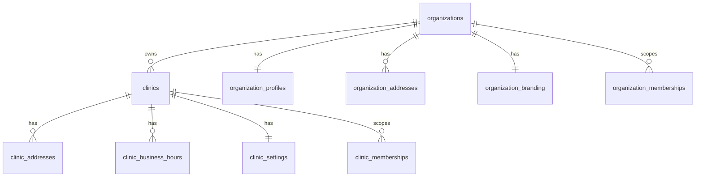

# Organization and Clinic Specification

Source of truth: migrations `001_core_schema.sql`, `004_indexes.sql`, `005_tenant_identity_memberships.sql`, `007_rbac_helpers_policies_indexes_seed.sql`, and completed Core Foundation documents.

## Existing Implementation

### Core Tables

| Table | Purpose | Key columns | Constraints and indexes |
| --- | --- | --- | --- |
| `organizations` | Tenant root for organization-level isolation | `id`, `name`, `legal_name`, `registration_number`, `country_code`, `timezone`, `code`, `organization_type`, `locale`, audit columns | PK `id`; unique `name`; partial unique index `uq_organizations_code_active`; `idx_organizations_code_active` |
| `clinics` | Clinic/facility boundary inside an organization | `id`, `organization_id`, `name`, `code`, `address_line`, `province`, `country_code`, `phone`, `clinic_type`, `is_primary`, audit columns | PK `id`; FK `organization_id -> organizations.id`; unique `(organization_id, code)`; unique `(organization_id, id)`; `idx_clinics_organization_id`, `idx_clinics_active_scope`, `idx_clinics_org_code_active` |
| `organization_profiles` | Extended one-to-one organization profile | `organization_id`, `display_name`, `tax_identifier_reference`, `website_url`, `support_email`, `support_phone`, `metadata`, audit columns | FK organization; unique `organization_id` |
| `organization_addresses` | Organization address records | `organization_id`, `address_type`, address fields, audit columns | FK organization; check `address_type in ('registered','billing','mailing','other')` |
| `organization_branding` | Organization branding asset references | `organization_id`, `logo_storage_path`, `primary_color`, `secondary_color`, audit columns | FK organization; unique `organization_id` |
| `clinic_addresses` | Clinic address records | `organization_id`, `clinic_id`, `address_type`, address fields, audit columns | Tenant-safe FK `(organization_id, clinic_id) -> clinics(organization_id, id)`; check address type |
| `clinic_business_hours` | Clinic schedule records | `organization_id`, `clinic_id`, `day_of_week`, `opens_at`, `closes_at`, `is_closed`, audit columns | Tenant-safe clinic FK; day check; open/close check; unique `(clinic_id, day_of_week)` |
| `clinic_settings` | Clinic operational settings | `organization_id`, `clinic_id`, `default_visit_duration_minutes`, `appointment_buffer_minutes`, `settings_payload`, audit columns | Tenant-safe clinic FK; unique `clinic_id`; positive duration and non-negative buffer checks |

### Tenant Isolation Model

- `organizations.id` is the root tenant identifier.
- `clinics.organization_id` binds each clinic to a tenant.
- `clinics` has a compatibility unique constraint on `(organization_id, id)` so child tables can enforce tenant-safe clinic foreign keys.
- Tenant and clinic-scoped tables use `organization_id` and `clinic_id` instead of trusting frontend-selected tenant context.

### RLS Policies

Existing migration `003` policies:

| Policy | Table | Operation | Summary |
| --- | --- | --- | --- |
| `organizations_select_scoped` | `organizations` | select | Current organization or `admin:manage_users` |
| `clinics_select_scoped` | `clinics` | select | Same organization plus clinic access, admin, or Executive |

Existing migration `007` policies:

| Policy | Table | Operation | Summary |
| --- | --- | --- | --- |
| `mvp1_organizations_select` | `organizations` | select | `is_organization_member(id)` |
| `mvp1_clinics_select` | `clinics` | select | `has_clinic_access(organization_id, id)` and `clinic.view` |
| `mvp1_clinic_memberships_select` | `clinic_memberships` | select | Organization member with clinic access |
| `mvp1_memberships_select` | `organization_memberships` | select | Organization member |

## Identified Gaps

- Organization and clinic lifecycle state history is not implemented.
- Storage object paths and policies for `organization-assets` are not defined.
- RLS policy generations coexist, so organization/clinic visibility can be affected by multiple permissive policies.
- `clinic_users` is a UI/business term, not a table; it maps to profiles, memberships, and role assignments.
- No executable SQL tests exist for organization and clinic isolation.

## Proposed Design

Proposed:
- Canonicalize organization/clinic access on `organization_memberships`, `clinic_memberships`, and `user_role_assignments`.
- Add SQL tests for cross-organization and cross-clinic denial before live repositories rely on these policies.
- Add lifecycle history only if product workflows require organization/clinic activation, suspension, transfer, or closure audit trails.
- Add storage object policies for organization assets using organization-scoped object paths.

Related references:
- [Core Foundation Specification](core-foundation-spec.md)
- [Core Foundation Security Model](core-foundation-security-model.md)
