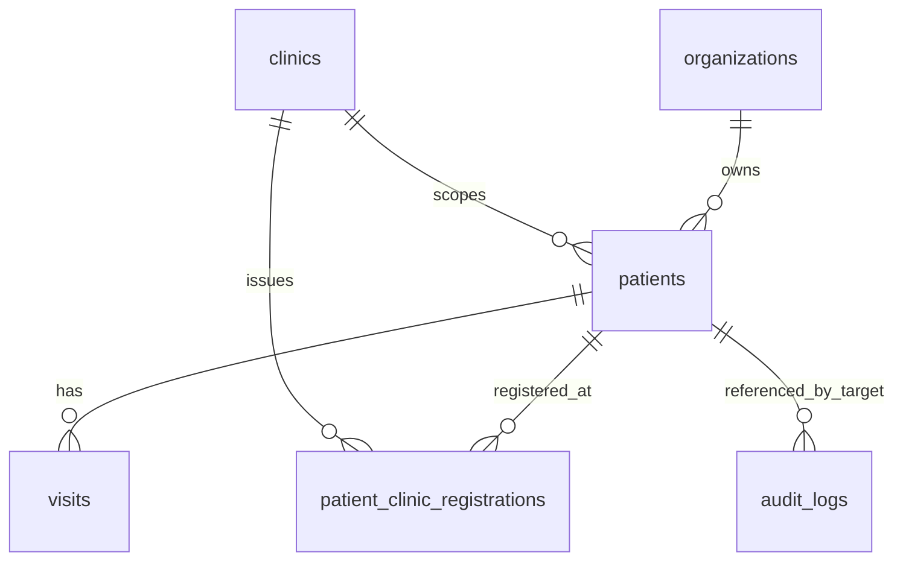

# Patient Data Model

Batch: DB-DOC-BATCH-4-PATIENT-VISIT  
Primary agent: Healthcare Domain and Database  
Reviewer: Security Compliance

## Purpose

Document the Patient domain as implemented in the repository and define safe proposed extensions. This document uses the migrations and completed Core Foundation documents as source of truth. It does not create schema.

## Existing Implementation

### Patient Master Identity

| Object | Classification | Evidence | Notes |
| --- | --- | --- | --- |
| `patients` | Existing | `001_core_schema.sql` | Master patient record scoped by `organization_id` and `clinic_id`. |
| `patient_clinic_registrations` | Existing | `006_clinical_claim_settings_tables.sql` | Clinic registration record for a patient in a clinic. |
| `clinical_documents` | Future | README gap | Not implemented as a table. |
| Patient merge workflow | Planned | product requirement only | No merge table, function, or workflow exists. |

`patients` columns:

| Column | Classification | Type | Constraint / index | Description |
| --- | --- | --- | --- | --- |
| `id` | Existing | uuid | PK, default `gen_random_uuid()` | Relational identifier. |
| `organization_id` | Existing | uuid | FK `organizations(id)`, `idx_patients_organization_id` | Tenant owner. |
| `clinic_id` | Existing | uuid | FK `clinics(id)`, `idx_patients_clinic_id` | Owning clinic scope. |
| `patient_code` | Existing | text | unique `(organization_id, patient_code)` | Separate business patient number. |
| `display_label` | Existing | text | not null | Patient label. PHI-sensitive. |
| `date_of_birth` | Existing | date | nullable | PHI-sensitive demographic. |
| `sex_at_birth` | Existing | text | controlled value check | PHI-sensitive demographic. |
| `consent_status` | Existing | text | check: `unknown`, `granted`, `restricted`, `revoked`, `expired` | Consent readiness field. |
| `consent_updated_at` | Existing | timestamptz | nullable | Consent timestamp. |
| audit columns | Existing | mixed | `set_patients_updated_at`, active-scope index | Created, updated, deleted, active metadata. |

`patient_clinic_registrations` columns:

| Column | Classification | Type | Constraint / index | Description |
| --- | --- | --- | --- | --- |
| `id` | Existing | uuid | PK, default `gen_random_uuid()` | Registration row id. |
| `organization_id` | Existing | uuid | tenant-safe clinic FK | Tenant owner. |
| `clinic_id` | Existing | uuid | tenant-safe clinic FK | Clinic issuing registration. |
| `patient_id` | Existing | uuid | FK `patients(id)` | Registered patient. |
| `registration_number` | Existing | text | unique `(organization_id, clinic_id, registration_number)` | Separate clinic registration number. |
| `registered_at` | Existing | timestamptz | default `now()` | Registration timestamp. |
| `registration_status` | Existing | text | check: `active`, `inactive`, `transferred` | Registration lifecycle. |
| audit columns | Existing | mixed | `set_patient_clinic_registrations_updated_at` | Lifecycle metadata. |

### Relationships

### Sensitive Data Classification

| Data | Classification | Handling rule |
| --- | --- | --- |
| `display_label`, date of birth, sex at birth | Existing PHI | Minimum necessary access through RLS and server-derived tenant scope. |
| `patient_code`, `registration_number` | Existing PHI/identifier | Not a relational key; must not be generated with `MAX()+1`. |
| `consent_status`, `consent_updated_at` | Existing PHI/compliance | Must be preserved for clinical and claim workflows. |
| Identity documents | Future | Must not be placed in unrestricted JSON metadata. |

### RLS Responsibility

Existing migration `003`:
- `patients_select_clinic_scoped`: requires organization, clinic, and `patient:read`.
- `patients_insert_clinic_scoped`: requires organization, clinic, and `patient:create`.

Existing migration `007`:
- `mvp1_patients_select`: requires clinic access and `patient.view`.
- `mvp1_patients_insert`: requires clinic access and `patient.create`.
- `mvp1_patients_update`: requires clinic access and `patient.update`.

Security rule:
- `organization_id` and `clinic_id` from the frontend are not authorization. Authorization must be derived from `auth.uid()`, membership, active role assignment, and permission checks.

## Identified Gaps

| Item | Classification | Gap |
| --- | --- | --- |
| Tenant-safe patient-to-clinic FK | Review Required | `patients.clinic_id` references `clinics(id)`, not `(organization_id, clinic_id)`. `patient_clinic_registrations` does use tenant-safe clinic FK. |
| Duplicate detection | Planned | Unique `patient_code` exists, but no duplicate matching table or workflow exists. |
| Contact data | Planned | No dedicated patient contact table exists. |
| Patient merge | Planned | No merge table, merge function, or merge audit workflow exists. |
| Consent workflow | Planned | Consent status fields exist, but no consent history table exists. |
| Soft deletion | Existing / Review Required | Soft-delete columns exist; no documented rule prevents deleting clinical history. |
| Claim ownership | Existing rule | Claim tables reference visits and evidence; they do not own patient identity. |
| `database-domain-map.md` | Review Required | Requested read target was absent. |
| `record-state-machines.md` | Review Required | Requested read target was absent. |

## Proposed Design

Proposed future entities:
- Proposed: `patient_contacts` for phones, email, emergency contact, address references, and verification status.
- Proposed: `patient_identity_documents` for storage references only, never raw unrestricted metadata.
- Proposed: `patient_duplicate_candidates` for probabilistic duplicate review using multiple signals, not names alone.
- Proposed: `patient_merge_requests` and `patient_merge_events` for authorized, audited merge readiness.
- Proposed: `patient_consent_history` for append-only consent changes.

Proposed patient creation flow:
1. Server derives organization and clinic scope from authenticated membership.
2. Validate patient demographic and consent payload.
3. Check duplicate candidates using patient code, registration number, date of birth, contact signals, and local policy.
4. Insert `patients` and `patient_clinic_registrations` in one transaction.
5. Emit audit event.
6. Return UUID and business identifiers.

High-risk operations:
- Patient merge, identity correction, patient deletion, and identity document changes require authorization, reason, audit event, and transaction boundary.

## Dependencies

- [Core Foundation Specification](core-foundation-spec.md)
- [Core Foundation Security Model](core-foundation-security-model.md)
- [Clinical Data Governance](clinical-data-governance.md)
