# Record State Machines

## Document Control
Status: Populated for DB-DOC-BATCH-5-DECISION-CLOSURE. This document is the canonical documentation vocabulary for clinical lifecycle states. Runtime effect: none.

## Existing Implementation
Existing database enum states remain unchanged:

| Domain | Existing object | Existing states |
|---|---|---|
| SOAP | `soap_status` | `draft`, `submitted`, `reviewed`, `amended`, `archived` |
| Prescription | `prescription_status` | `draft`, `pending_review`, `approved_by_clinician`, `dispensed`, `cancelled` |
| Diagnosis coding | `visit_diagnoses.coding_status` check | `draft`, `suggested`, `accepted`, `rejected`, `amended` |
| Claim readiness | `claim_readiness_assessments.review_status` check | `pending_review`, `accepted`, `needs_changes`, `rejected` |
| Evidence packages | `evidence_packages.package_status` check | `draft`, `review_needed`, `complete`, `approved`, `submitted`, `superseded` |

## Identified Gaps
- Existing database states do not yet model signed SOAP records, medical certificates, durable medication safety alerts, dispensing reversal, or diagnosis clinical finality.
- Existing implementation uses `reviewed`, `accepted`, and `approved_by_clinician` in places where the canonical future model needs more precise authority boundaries.
- No database object currently enforces professional credential validation for high-risk clinical actions.

## Proposed Design
Use snake_case lifecycle states. Do not use one state name across domains unless the business meaning is the same.

## Canonical Professional-Authority Gate
Planned enforcement for high-risk clinical actions:

```mermaid
flowchart LR
  A[Active authenticated user] --> B[Active user profile]
  B --> C[Valid organization and clinic membership]
  C --> D[Active clinical role]
  D --> E[Required permission]
  E --> F[Verified non-expired professional credential]
  F --> G[Valid professional scope]
  G --> H[Valid patient and visit relationship]
  H --> I[Allow action]
  I --> J[Audit event]
```

Future credential entities:

| Entity | Purpose | Domain | Key relationships | Status | Effective dates | Verification source | Audit | RLS | Review Required |
|---|---|---|---|---|---|---|---|---|---|
| `professional_credentials` | Stores professional identity and license facts | Clinical governance | `user_profiles`, organization, jurisdiction | `pending_verification`, `verified`, `expired`, `suspended`, `revoked`, `rejected` | issue, effective, expiry | Issuing authority or verified registry | create/update/status change | organization and minimum necessary | Exact credential fields |
| `professional_credential_verifications` | Stores verification attempts and outcomes | Compliance | credential, verifier, source | same outcome vocabulary where applicable | verified_at, expires_at | registry/manual evidence | every verification result | compliance scoped | Source trust model |
| `professional_scope_assignments` | Grants action-specific clinical scope | Clinical governance | credential, organization, clinic, action | active/inactive future status | effective_from/to | organization appointment | every scope change | clinic scoped | Scope taxonomy |
| `professional_suspensions` | Temporarily blocks professional actions | Compliance | credential, organization/clinic | active/resolved future status | suspended_from/to | compliance decision | required | restricted | Appeal/reinstatement workflow |

Canonical credential statuses: `pending_verification`, `verified`, `expired`, `suspended`, `revoked`, `rejected`.

## SOAP Lifecycle
| State | Meaning | Prior states | Next states | Terminal | Permission | Professional authority | Reason | Audit event | Mutation restrictions | Correction strategy |
|---|---|---|---|---|---|---|---|---|---|---|
| `draft` | Editable clinical draft | none, `under_review` | `under_review`, `voided` | No | `clinical.soap.create`, `clinical.soap.update` | Clinical contributor | Optional | `soap.draft_saved` | Mutable | Update draft |
| `under_review` | Submitted for clinical review | `draft` | `signed`, `draft`, `voided` | No | `clinical.soap.review` | Reviewer scope | Required for rejection | `soap.reviewed` | Review annotations only | Return to draft |
| `signed` | Immutable signed clinical record | `under_review` | `amended`, `superseded`, `voided` | No | `clinical.soap.sign` | Verified signing scope | Required | `soap.signed` | No in-place content update | Amendment or void |
| `amended` | Signed record with controlled amendment | `signed` | `superseded`, `voided` | No | `clinical.soap.amend` | Verified amendment scope | Required | `soap.amended` | Prior signed version retained | New version |
| `superseded` | Replaced by later signed record | `signed`, `amended` | none | Yes | `clinical.soap.sign` | Verified signing scope | Required | `soap.superseded` | Read-only | Reference replacement |
| `voided` | Invalidated clinical record retained for history | `draft`, `under_review`, `signed`, `amended` | none | Yes | `clinical.soap.void` | Clinical/compliance scope | Required | `soap.voided` | Read-only | Historical trace |

Terminology: use `signed`, not `completed`; use `voided`, not `invalid`; `amended` changes content by version, `superseded` replaces the whole signed record.

## Diagnosis Lifecycle
| State | Meaning | Prior states | Next states | Terminal | Permission | Professional authority | Reason | Audit event | Mutation restrictions | Correction strategy |
|---|---|---|---|---|---|---|---|---|---|---|
| `provisional` | Working diagnosis | none | `confirmed`, `ruled_out`, `entered_in_error` | No | `clinical.diagnosis.create`, `clinical.diagnosis.update` | Clinical contributor | Optional | `diagnosis.created` | Mutable before confirmation | Update/version |
| `confirmed` | Clinically confirmed diagnosis | `provisional`, `amended` | `amended`, `ruled_out`, `entered_in_error` | No | `clinical.diagnosis.confirm` | Verified clinician | Required | `diagnosis.confirmed` | No silent rewrite | Amendment |
| `amended` | Confirmed diagnosis corrected by controlled change | `confirmed` | `confirmed`, `entered_in_error` | No | `clinical.diagnosis.amend` | Verified clinician | Required | `diagnosis.amended` | Prior version retained | New version |
| `ruled_out` | Considered and clinically ruled out | `provisional`, `confirmed` | none | Yes | `clinical.diagnosis.update` | Clinical contributor or verified clinician by context | Required | `diagnosis.ruled_out` | Read-only after transition | Historical trace |
| `entered_in_error` | Erroneous diagnosis retained for traceability | `provisional`, `confirmed`, `amended` | none | Yes | `clinical.diagnosis.mark_error` | Verified clinician/compliance | Required | `diagnosis.entered_in_error` | Read-only | Historical trace |

Terminology: use `confirmed`, not `final`; payer or claim correction cannot change clinical diagnosis state automatically.

## Prescription Lifecycle
| State | Meaning | Prior states | Next states | Terminal | Permission | Professional authority | Reason | Audit event | Mutation restrictions | Correction strategy |
|---|---|---|---|---|---|---|---|---|---|---|
| `draft` | Editable medication order draft | none | `ordered`, `cancelled` | No | `prescription.order.create`, `prescription.order.update` | Prescriber scope before ordering | Optional | `prescription.draft_saved` | Mutable | Update draft |
| `ordered` | Prescriber has placed the order | `draft` | `verified`, `cancelled` | No | `prescription.order.create` | Verified prescriber | Required for cancel | `prescription.ordered` | Controlled edits | Amend/cancel |
| `verified` | Pharmacist/authorized verifier approved for dispensing | `ordered` | `partially_dispensed`, `dispensed`, `cancelled` | No | `prescription.order.verify` | Verification scope | Required for rejection/cancel | `prescription.verified` | No prescriber-content rewrite by pharmacy | Reverify |
| `partially_dispensed` | Some quantity dispensed | `verified`, `partially_dispensed` | `dispensed`, `reversed` | No | `prescription.order.dispense` | Pharmacist scope | Required for reversal | `prescription.partially_dispensed` | Dispensed lines immutable except reversal | Controlled reversal |
| `dispensed` | Full intended quantity dispensed | `verified`, `partially_dispensed` | `reversed` | No | `prescription.order.dispense` | Pharmacist scope | Required for reversal | `prescription.dispensed` | Dispense history immutable | Controlled reversal |
| `cancelled` | Order cancelled before dispensing completion | `draft`, `ordered`, `verified` | none | Yes | `prescription.order.cancel` | Prescriber or authorized cancellation scope | Required | `prescription.cancelled` | Read-only | Historical trace |
| `reversed` | Dispensing reversed with retained original event | `partially_dispensed`, `dispensed` | none | Yes | `prescription.order.reverse` | Pharmacist/compliance scope | Required | `prescription.reversed` | Original event retained | Reversal event |

Terminology: use `cancelled` for prescriptions, not `revoked`; use `reversed` only after dispensing.

## Medication Safety Alert Lifecycle
| State | Meaning | Prior states | Next states | Terminal | Permission | Professional authority | Reason | Audit event | Mutation restrictions | Correction strategy |
|---|---|---|---|---|---|---|---|---|---|---|
| `generated` | Alert detected by rule, import, or AI | none | `acknowledged`, `overridden`, `resolved`, `dismissed` | No | `prescription.safety_alert.read` | None for read | No | `medication_alert.generated` | Evidence immutable | Recalculate as new evaluation |
| `acknowledged` | User saw alert but did not override it | `generated` | `overridden`, `resolved`, `dismissed` | No | `prescription.safety_alert.acknowledge` | Role appropriate to workflow | Optional | `medication_alert.acknowledged` | Alert remains active | Resolve or override |
| `overridden` | Authorized user proceeds despite alert | `generated`, `acknowledged` | `resolved` | No | `prescription.safety_alert.override` | Verified prescriber/pharmacist as applicable | Required | `medication_alert.overridden` | Override reason immutable | New review |
| `resolved` | Risk removed or no longer applicable | `generated`, `acknowledged`, `overridden` | none | Yes | `prescription.safety_alert.resolve` | Workflow-specific | Required | `medication_alert.resolved` | Read-only | Historical trace |
| `dismissed` | Alert judged not applicable | `generated`, `acknowledged` | none | Yes | `prescription.safety_alert.dismiss` | Authorized reviewer | Required | `medication_alert.dismissed` | Read-only | Historical trace |

Terminology: acknowledgement is not override; dismissal is not resolution.

## Medical Certificate Lifecycle
| State | Meaning | Prior states | Next states | Terminal | Permission | Professional authority | Reason | Audit event | Mutation restrictions | Correction strategy |
|---|---|---|---|---|---|---|---|---|---|---|
| `draft` | Editable certificate draft | none | `under_review`, `entered_in_error` | No | `clinical.medical_certificate.create` | Clinical contributor | Optional | `certificate.drafted` | Mutable | Update draft |
| `under_review` | Awaiting review/signature | `draft` | `issued`, `draft`, `entered_in_error` | No | `clinical.medical_certificate.review` | Reviewer scope | Required for return/error | `certificate.reviewed` | Review edits only | Return to draft |
| `issued` | Signed certificate issued to patient | `under_review` | `revoked`, `superseded`, `expired` | No | `clinical.medical_certificate.issue` | Verified signing scope | Required | `certificate.issued` | No in-place edit | Revoke/supersede/reissue |
| `revoked` | Issued certificate invalidated | `issued` | none | Yes | `clinical.medical_certificate.revoke` | Signing/compliance scope | Required | `certificate.revoked` | Read-only | Historical trace |
| `superseded` | Issued certificate replaced | `issued` | none | Yes | `clinical.medical_certificate.reissue` | Verified signing scope | Required | `certificate.superseded` | Read-only | Link replacement |
| `expired` | Validity period elapsed | `issued` | none | Yes | system/read | Not applicable | No | `certificate.expired` | Read-only | Derived status allowed |
| `entered_in_error` | Draft/review record was erroneous | `draft`, `under_review` | none | Yes | `clinical.medical_certificate.revoke` | Clinical/compliance scope | Required | `certificate.entered_in_error` | Read-only | Historical trace |

Terminology: use `issued`, not `active`; use `revoked`, not `cancelled`, for issued certificates.

## Visit Lifecycle
| State | Meaning | Prior states | Next states | Terminal | Permission | Professional authority | Reason | Audit event | Mutation restrictions | Correction strategy |
|---|---|---|---|---|---|---|---|---|---|---|
| `draft` | Visit record prepared but not queued for care | none | `waiting`, `cancelled`, `archived` | No | `visit.create`, future `clinical.visit.create` | Not applicable unless clinical data is added | Optional | `visit.created` | administrative fields mutable | update draft |
| `waiting` | Patient is checked in or waiting for clinical encounter | `draft` | `in_consultation`, `cancelled`, `no_show` | No | `visit.update_status` | Not applicable | Optional for cancellation/no-show | `visit.status_changed` | no clinical finalization | status transition |
| `in_consultation` | Clinical encounter is active | `waiting`, `reopened` | `pharmacy`, `completed`, `cancelled` | No | `visit.update_status` | Clinical participation may be required by workflow | Required for cancellation | `visit.status_changed` | clinical edits governed by clinical domains | transition or reopen |
| `pharmacy` | Medication fulfillment or pharmacy review is pending | `in_consultation` | `completed`, `reopened` | No | `visit.update_status` | Pharmacy authority for dispensing tasks | Required for reopen | `visit.status_changed` | visit status only; prescription state remains separate | return to consultation |
| `completed` | Visit workflow completed | `in_consultation`, `pharmacy` | `reopened`, `archived` | No | `visit.update_status` | Clinical/compliance authority required for reopen | Required for reopen | `visit.completed` | post-completion clinical changes use amendments | controlled reopen |
| `cancelled` | Visit cancelled before completion | `draft`, `waiting`, `in_consultation` | `archived` | Yes for normal workflow | `visit.update_status` | Not applicable | Required | `visit.cancelled` | read-only except audit/correction | archive |
| `no_show` | Patient did not attend | `waiting` | `archived` | Yes for normal workflow | `visit.update_status` | Not applicable | Required | `visit.no_show` | read-only except audit/correction | archive |
| `reopened` | Completed visit reopened under controlled reason | `completed`, `pharmacy` | `in_consultation`, `completed`, `archived` | No | future `clinical.visit.reopen` | Clinical/compliance scope | Required | `visit.reopened` | prior completed state retained in future history | controlled transition |
| `archived` | Visit retained but removed from active workflow | `completed`, `cancelled`, `no_show`, `reopened` | none | Yes | future `clinical.visit.archive` | Compliance/operations scope | Required | `visit.archived` | read-only | historical trace |

Existing database enum `visit_status` is Compatibility Sensitive because it currently contains `scheduled`, `checked_in`, `in_consultation`, `completed`, `cancelled`, and `no_show`, not the full canonical vocabulary above. Mapping from `scheduled` to `draft` and `checked_in` to `waiting` requires an approved migration plan.

## Cross-Document Contract
Future migrations, RLS policies, tests, and workflows must reference these canonical states unless a migration explicitly documents a compatibility transition from existing enum values. Existing implementation names remain Compatibility Sensitive until migrated.

## Core Foundation Organization and Clinic Lifecycle

Migration `011_core_foundation_lifecycle_controls.sql` implements the Core Foundation lifecycle vocabulary for organizations and clinics.

States for both domains:

| State | Meaning | Operational effect |
|---|---|---|
| `active` | Normal approved operational state. | Normal helper-mediated access may proceed within permission scope. |
| `suspended` | Temporary operational access denial. | Normal operational access fails closed; records remain preserved. |
| `closed` | Operations are no longer active. | Normal operational access fails closed; historical records remain preserved. |
| `archived` | Long-term historical state. | Normal operational access fails closed; recovery is denied by default. |

Allowed transitions:

| Source | Target | Notes |
|---|---|---|
| `active` | `suspended` | Requires lifecycle suspend permission and reason. |
| `suspended` | `active` | Organization reactivation requires platform recovery; clinic reactivation requires lifecycle permission and active organization. |
| `active` | `closed` | Requires lifecycle close permission and reason. |
| `suspended` | `closed` | Requires lifecycle close permission and reason. |
| `closed` | `archived` | Requires lifecycle archive permission and reason. |

Review Required:

- `closed -> active` remains denied and requires product/security approval before any future implementation.
- Full audit-event emission for lifecycle transitions remains planned.
- Downstream Patient, Visit, Clinical, Claim, Evidence, and AI domain enforcement remains a later phase.
