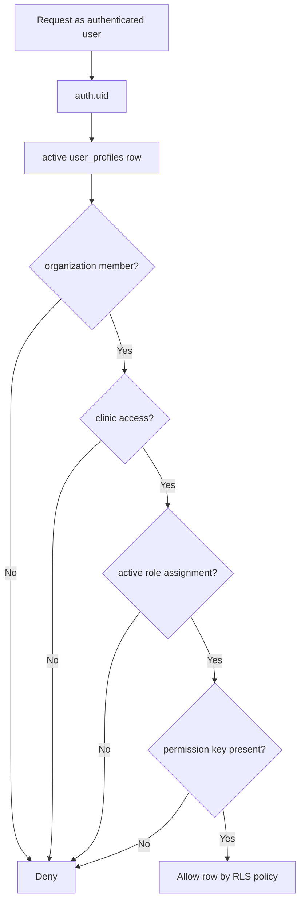

# RLS Policy Design

Source of truth: migrations `003_rls_policies.sql`, `007_rbac_helpers_policies_indexes_seed.sql`, and completed Core Foundation documents.

## Existing Implementation

### Helper Functions

| Generation | Function | Purpose |
| --- | --- | --- |
| Migration `003` | `current_user_profile()` | Active profile row for `auth.uid()` |
| Migration `003` | `current_user_organization_id()` | Active user's organization |
| Migration `003` | `current_user_clinic_ids()` | Primary clinic plus clinic ids from `user_roles` |
| Migration `003` | `current_user_has_role(text)` | Role check through `user_roles` |
| Migration `003` | `current_user_has_permission(text)` | Permission check through `user_roles` |
| Migration `007` | `current_user_profile_id()` | Active profile id |
| Migration `007` | `is_organization_member(uuid)` | Membership or active profile organization check |
| Migration `007` | `has_clinic_access(uuid, uuid)` | Clinic membership, primary clinic, or org-level assignment |
| Migration `007` | `has_permission(text, uuid, uuid)` | Active non-expired role assignment with permission |

Migration `007` revokes helper execution from `public` and grants execution to `authenticated`.

### RLS Enabled Foundation Tables

| Area | Tables |
| --- | --- |
| Organization/clinic | `organizations`, `clinics`, organization/clinic profile and settings tables |
| Identity/RBAC | `user_profiles`, `roles`, `permissions`, `user_roles`, `role_permissions`, `organization_memberships`, `clinic_memberships`, `user_role_assignments` |
| Clinical and operations | `patients`, `visits`, `soap_notes`, `soap_note_versions`, prescriptions, inventory, visit vitals, diagnoses |
| Claim/evidence/audit | claim readiness tables, `evidence_packages`, `audit_logs` |

### Core Policy Families

Migration `003` policy family:
- Uses colon permissions such as `patient:read`, `visit:update`, and `audit_log:read`.
- Uses `user_roles`.
- Includes policies such as `patients_select_clinic_scoped`, `visits_update_clinic_scoped`, `user_roles_manage_admin`, and `audit_logs_read_restricted`.

Migration `007` `mvp1_*` policy family:
- Uses dot permissions such as `patient.view`, `visit.update_status`, and `audit.view`.
- Uses `organization_memberships`, `clinic_memberships`, and `user_role_assignments`.
- Drops only pre-existing policies whose names match `mvp1_%` before recreating them.

### Access Decision Flow

### Policy Examples

| Table | Migration `003` policy | Migration `007` policy |
| --- | --- | --- |
| `organizations` | `organizations_select_scoped` | `mvp1_organizations_select` |
| `clinics` | `clinics_select_scoped` | `mvp1_clinics_select` |
| `patients` | `patients_select_clinic_scoped`, `patients_insert_clinic_scoped` | `mvp1_patients_select`, `mvp1_patients_insert`, `mvp1_patients_update` |
| `visits` | `visits_select_clinic_scoped`, `visits_update_clinic_scoped` | `mvp1_visits_select`, `mvp1_visits_insert`, `mvp1_visits_update` |
| `soap_notes` | `soap_notes_select_scoped`, `soap_notes_write_scoped` | `mvp1_soap_select`, `mvp1_soap_insert`, `mvp1_soap_update` |
| `audit_logs` | `audit_logs_read_restricted`, `audit_logs_insert_scoped` | `mvp1_audit_logs_select`, `mvp1_audit_logs_insert` |
| RBAC assignment | `user_roles_select_scoped`, `user_roles_manage_admin` | `mvp1_role_assignments_select` |

## Identified Gaps

- Multiple permissive policies may coexist on the same table because migration `007` does not remove migration `003` policy names.
- Storage object RLS policies are not implemented.
- No SQL tests exist for anonymous denial, no-profile denial, cross-tenant denial, cross-clinic denial, expired role assignment denial, or suspended membership denial.
- Dot and colon permission models can produce inconsistent authorization behavior.
- Some catalog tables are broadly readable by authenticated users in migration `003`.

## Proposed Design

Proposed:
- Choose one canonical RLS policy family and retire the other through a compatibility migration.
- Prefer the migration `007` model if adopting `organization_memberships`, `clinic_memberships`, `user_role_assignments`, dot permissions, and role expiry.
- Add SQL RLS tests before replacing mock repositories with live Supabase queries.
- Add object-level storage policies for private buckets.
- Keep tenant and clinic scope derived from `auth.uid()` and database membership, never from client-provided context alone.

Related references:
- [Core Foundation Security Model](core-foundation-security-model.md)
- [RBAC Design](rbac-design.md)
