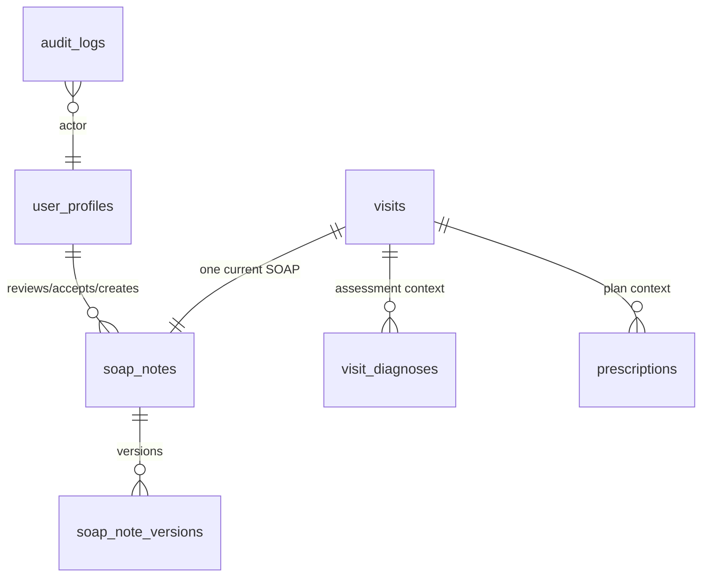

# SOAP Clinical Model

## 1. Document Control
Status: Populated for DB-DOC-BATCH-5-CLINICAL. Source of truth: Supabase migrations `001_core_schema.sql`, `003_rls_policies.sql`, `004_indexes.sql`, `006_clinical_claim_settings_tables.sql`, and `007_rbac_helpers_policies_indexes_seed.sql`. Runtime effect: none.

## 2. Purpose
Defines the SOAP clinical documentation model for Med AI NexSure. SOAP is clinical evidence, not an administrative note, and must remain human-reviewed when AI assists.

## 3. Scope
Existing: `soap_notes`, `soap_note_versions`, `visits`, `patients`, `user_profiles`, `visit_diagnoses`, `prescriptions`, `audit_logs`, RLS helpers and policies. Future: `soap_signatures`, `soap_amendments`, `soap_ai_suggestions`, `soap_evidence_references`.

## 4. Current Repository State
`soap_notes` stores the current note per visit. `soap_note_versions` stores version history. Migration `006` adds AI metadata to `soap_notes`: `source_type`, `model_name`, `model_version`, `confidence`, `accepted_by`, `accepted_at`, and `edited_after_generation`. No dedicated signature, amendment, or AI suggestion table exists.

## 5. SOAP Domain Ownership
Owner: Clinical domain. RBAC grants access through `soap.view`, `soap.create`, `soap.update`, and `soap.approve_ai_content`. Administrative authority does not imply clinical authority or signing authority.

## 6. SOAP versus General Clinical Note
Existing `soap_notes` has governed columns for `subjective`, `objective`, `assessment`, and `plan`. General clinical-document metadata is not implemented as an existing table. SOAP must not be collapsed into unrestricted JSON.

## 7. SOAP Entity Model

## 8. Subjective Section
Existing column: `soap_notes.subjective text null`; versioned in `soap_note_versions.subjective`. Security classification: Restricted Clinical PHI.

## 9. Objective Section
Existing column: `soap_notes.objective text null`; versioned in `soap_note_versions.objective`. Related vitals exist separately in `visit_vitals`.

## 10. Assessment Section
Existing column: `soap_notes.assessment text null`; diagnosis coding is modeled separately in `visit_diagnoses`.

## 11. Plan Section
Existing column: `soap_notes.plan text null`; prescription orders are modeled separately in `prescriptions` and `prescription_items`.

## 12. Draft Lifecycle
Existing enum `soap_status`: `draft`, `submitted`, `reviewed`, `amended`, `archived`. Required target states `under_review`, `signed`, `superseded`, and `voided` are Proposed because they are not present in the enum.

| Required state | Classification | Existing equivalent or gap |
|---|---|---|
| `draft` | Existing | `soap_status.draft` |
| `under_review` | Proposed | Approximate existing `submitted` |
| `signed` | Proposed | No signature state |
| `amended` | Existing | `soap_status.amended` |
| `superseded` | Proposed | No enum value |
| `voided` | Proposed | No enum value |

## 13. Author Relationship
Existing audit columns `created_by` and `updated_by` reference `user_profiles(id)`.

## 14. Reviewer Relationship
Existing columns: `reviewed_by uuid references user_profiles(id)` and `reviewed_at timestamptz`.

## 15. Signer Relationship
Future: `soap_signatures` or signer columns are required for signed clinical records. Existing schema does not distinguish reviewer from signer.

## 16. Professional Authority
Review Required: no table validates professional license, specialty, or active clinical credential. RBAC role `doctor` has SOAP permissions, but role assignment alone must not be treated as signing authority.

## 17. Visit Relationship
Existing: `soap_notes.visit_id uuid not null references visits(id) on delete restrict`; `soap_notes_visit_unique` enforces one current SOAP note per visit.

## 18. Patient Relationship
Existing: patient relationship is indirect through `visits.patient_id`. Tenant safety depends on application and RLS consistency because `soap_notes` does not have a composite FK to `visits(organization_id, clinic_id, id)`.

## 19. Diagnosis Relationship
Existing: `visit_diagnoses` belongs to the same visit context. There is no direct SOAP-to-diagnosis FK.

## 20. Prescription Relationship
Existing: `prescriptions.visit_id` links medication plans to the visit. There is no direct SOAP-to-prescription FK.

## 21. Clinical Evidence Relationship
Existing: `evidence_packages` exists for visit evidence packages. Future: `soap_evidence_references` should link SOAP sections to specific evidence without duplicating PHI.

## 22. AI Suggestion Relationship
Existing AI metadata is embedded on `soap_notes`. Future: `soap_ai_suggestions` should persist raw suggestions separately from accepted human-authored SOAP truth.

## 23. AI Evidence and Confidence
Existing: `model_name`, `model_version`, `confidence numeric(5,2)`, and `ck_soap_notes_ai_confidence` constrain confidence 0-100. Gap: prompt/policy version and evidence references are not implemented. AI confidence must not be treated as calibrated probability unless validated.

## 24. Human Acceptance and Rejection
Existing: `accepted_by`, `accepted_at`, and `ck_soap_notes_ai_acceptance` require accepted AI content in `reviewed` status to have an accepting user and timestamp. Gap: rejection reason is not modeled.

## 25. Draft Review
Existing `submitted` and `reviewed` states support a minimal draft-review concept. Proposed `under_review` should replace or map from `submitted` only through a controlled enum migration.

## 26. Signing
Proposed: signing requires authenticated actor, `soap.sign` permission, validated professional authority, immutable signed version creation, and `audit_logs.action_type = 'clinical_review'` or a future specific action.

## 27. Versioning
Existing: `soap_note_versions` has `version integer not null`, `change_reason text not null`, unique `(soap_note_id, version)`, and `version > 0`. Gap: no database trigger enforces version creation on update.

## 28. Controlled Amendment
Existing `amended` status exists. Proposed rule: signed content cannot be updated in place; amendment creates a new version linked to the prior signed version. Existing schema lacks prior-version linkage.

## 29. Correction Reason
Existing: `soap_note_versions.change_reason text not null`. Proposed amendment model should classify reason type and require signer/amendment author.

## 30. Concurrent Editing
Gap: no `lock_version`, editor lease, or explicit optimistic locking column. Use `current_version` as readiness signal only; application must not silently overwrite concurrent edits.

## 31. Optimistic Locking Readiness
Proposed: updates include expected `current_version`; version insert and note update occur in one transaction.

## 32. Data Classification
SOAP sections, AI metadata, acceptance metadata, and versions are Restricted Clinical PHI. Audit rows are Restricted Security and Compliance data.

## 33. Minimum Necessary Access
RLS restricts by organization, clinic, and permission. UI must request only visit-scoped SOAP data needed for the user workflow.

## 34. Audit Events
Existing enum includes `create`, `update`, `view`, `export`, and `clinical_review`. Proposed SOAP events: `soap.draft_created`, `soap.submitted`, `soap.signed`, `soap.amended`, `soap.voided`, `soap.ai_accepted`, `soap.ai_rejected`.

## 35. RLS Responsibility
Existing older policies use colon permissions (`soap:read`, `soap:update`). Existing newer policies use dot permissions: `mvp1_soap_select`, `mvp1_soap_insert`, `mvp1_soap_update`.

## 36. Constraints
Existing constraints: PK `id`, FKs to organization/clinic/visit/user profiles, unique `soap_notes_visit_unique`, completeness check 0-100, AI confidence check, AI acceptance check, `soap_note_versions_unique`, and version positive check.

## 37. Index Strategy
Existing indexes: `idx_soap_notes_organization_id`, `idx_soap_notes_clinic_id`, `idx_soap_notes_visit_id`, `idx_soap_notes_status`, `idx_soap_notes_created_at`, `idx_soap_note_versions_organization_id`, `idx_soap_note_versions_clinic_id`, `idx_soap_note_versions_soap_note_id`, `idx_soap_note_versions_created_at`.

## 38. Transaction Boundaries
Proposed: draft save updates `soap_notes`; versioned review/sign/amend inserts `soap_note_versions`, updates `soap_notes.current_version/status`, and inserts `audit_logs` in one transaction.

## 39. Failure Handling
If professional authority, RLS, version expectation, or audit insert fails, the clinical state transition must fail as a unit.

## 40. Retention
Soft-delete columns exist, but signed clinical versions should be retained according to compliance policy. Deletion of signed records is Review Required.

## 41. Future Extensions
Future: `soap_signatures`, `soap_amendments`, `soap_ai_suggestions`, `soap_evidence_references`, professional credential table, explicit signed-state enum migration.

## 42. Compatibility-sensitive Items
`soap_status` enum values; `soap_notes.status`; `soap_notes.current_version`; permission keys `soap:*` versus `soap.*`; unique one-note-per-visit contract.

## 43. Review Required Decisions
Canonical SOAP state names are standardized in `record-state-machines.md`. Remaining Review Required items: choose the exact credential verification source, decide amendment linkage shape, define AI evidence reference model, and plan migration from existing `soap_status` enum values.

## Required State Transitions
| From | To | Actor | Permission | Professional authority | Validation | Reason | Transaction | Audit | Reversible | Mutation restrictions | Failure behavior |
|---|---|---|---|---|---|---|---|---|---|---|---|
| `draft` | `under_review` | Author | `clinical.soap.update` | Clinical contributor | Visit active, tenant scoped | Optional | SOAP update + audit | `soap.submitted` | Yes | Draft sections mutable | No state change |
| `under_review` | `signed` | Signer | `clinical.soap.sign` | Verified non-expired signing credential and scope | Complete SOAP, accepted AI separated | Required if corrections made | version + status + audit | `soap.signed` | No direct edit | Signed content immutable | Roll back all writes |
| `signed` | `amended` | Amendment author | `clinical.soap.amend` | Verified non-expired amendment credential and scope | Prior signed version exists | Required | new version + status + audit | `soap.amended` | Supersession only | Prior version retained | Roll back all writes |
| `amended` | `superseded` | Signer | `clinical.soap.sign` | Verified non-expired signing credential and scope | Replacement signed | Required | version + status + audit | `soap.superseded` | No | Historical versions retained | Roll back all writes |
| Any non-final | `voided` | Authorized clinician/compliance | `clinical.soap.void` | Clinical or compliance credential/scope by policy | Reason and target valid | Required | status + audit | `soap.voided` | Review Required | No deletion | Roll back all writes |

## Decision Closure References
Canonical lifecycle: `record-state-machines.md`.

Canonical permissions: `clinical.soap.read`, `clinical.soap.create`, `clinical.soap.update`, `clinical.soap.review`, `clinical.soap.sign`, `clinical.soap.amend`, `clinical.soap.void`.

Professional authority model: Future credential enforcement follows active authenticated user, active profile, valid organization/clinic membership, active clinical role, required permission, verified non-expired professional credential, valid professional scope, valid patient/visit relationship, allow action, and audit event. Enforcement is Planned because credential tables are not implemented.
