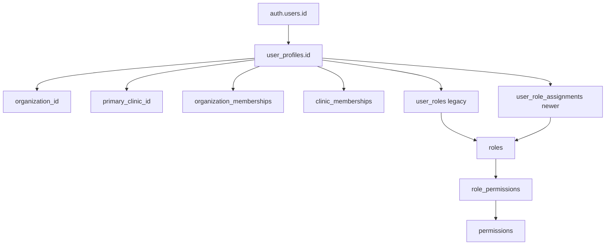

# User Profile Specification

Source of truth: migrations `001_core_schema.sql`, `004_indexes.sql`, `005_tenant_identity_memberships.sql`, `007_rbac_helpers_policies_indexes_seed.sql`, and completed Core Foundation documents.

## Existing Implementation

### `user_profiles`

`user_profiles` is the application identity profile anchored to Supabase Auth.

| Column | Type | Constraint or index | Description |
| --- | --- | --- | --- |
| `id` | uuid | PK, FK `auth.users(id) on delete cascade` | Auth-linked user id |
| `organization_id` | uuid | FK `organizations(id)`, `idx_user_profiles_organization_id` | Tenant owner |
| `primary_clinic_id` | uuid | FK `clinics(id)`, tenant-safe FK `(organization_id, primary_clinic_id)`, `idx_user_profiles_primary_clinic_id` | Primary clinic |
| `display_name` | text | not null | Display name |
| `email` | text | not null, unique, `idx_user_profiles_email` | User email |
| `job_title` | text | nullable | Job title |
| `department` | text | nullable | Department |
| audit columns | mixed | trigger `set_user_profiles_updated_at` | Creation/update/soft-delete metadata |

### Membership Tables

| Table | Purpose | Constraints and indexes |
| --- | --- | --- |
| `organization_memberships` | Active/invited/suspended/revoked organization membership | unique `(organization_id, user_profile_id)`; status check; `idx_organization_memberships_lookup` |
| `clinic_memberships` | Active/suspended/revoked clinic membership | tenant-safe clinic FK; unique `(organization_id, clinic_id, user_profile_id)`; status check; `idx_clinic_memberships_lookup` |

### Role Assignment Tables

| Table | Status | User column | Scope |
| --- | --- | --- | --- |
| `user_roles` | Existing legacy | `user_id` | `organization_id`, optional `clinic_id` |
| `user_role_assignments` | Existing newer | `user_profile_id` | `organization_id`, optional `clinic_id`, status and expiry |

### Identity and Access Flow

### RLS Policies

Existing migration `003` policies:
- `user_profiles_select_scoped`: user can select self, or same-organization profiles with `admin:manage_users`.
- `user_profiles_update_own`: user can update only self.
- `user_roles_select_scoped`: user can select own assignments or same-organization assignments with `admin:manage_users`.
- `user_roles_manage_admin`: same-organization admin can manage legacy assignments.

Existing migration `007` policies:
- `mvp1_memberships_select`: organization members can select organization memberships.
- `mvp1_clinic_memberships_select`: organization members with clinic access can select clinic memberships.
- `mvp1_role_assignments_select`: user can select own newer role assignments, or users with `role.assign` can select assignments in scope.

## Identified Gaps

- No invitation table exists; `organization_memberships.membership_status = 'invited'` exists but invitation token/workflow tables are not implemented.
- No dedicated user security event table exists beyond `audit_logs`.
- `user_profiles_update_own` allows self-update but does not document field-level restrictions.
- `user_roles` and `user_role_assignments` coexist.
- Permission and role naming are split across old and new seed generations.
- No SQL tests exist for inactive, suspended, revoked, or expired access behavior.

## Proposed Design

Proposed:
- Use `user_role_assignments` as the canonical future role assignment table after compatibility review.
- Keep `user_profiles` minimal and avoid storing secrets, passwords, tokens, or raw credentials.
- Add server-side user provisioning flows that derive tenant scope from authenticated context and audited admin authority.
- Add SQL tests for inactive profiles, suspended memberships, revoked memberships, and expired assignments.
- Add a Proposed invitation model only after auth workflow requirements are approved.

Related references:
- [RBAC Design](rbac-design.md)
- [RLS Policy Design](rls-policy-design.md)
