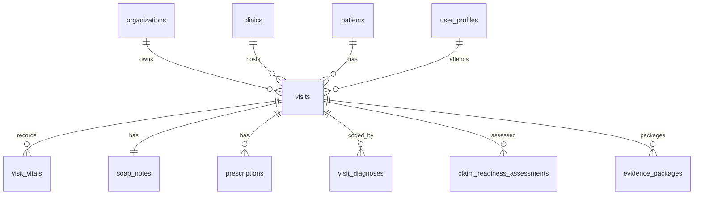

# Visit Data Model

Batch: DB-DOC-BATCH-4-PATIENT-VISIT  
Primary agent: Database and Healthcare Domain  
Reviewer: Security Compliance

## Purpose

Document the Visit domain as implemented in the repository and define safe proposed extensions. The database table name is `visits`; product language may also say encounter, but the implemented contract uses visit.

## Existing Implementation

### Visit versus Encounter Terminology

| Item | Classification | Repository status |
| --- | --- | --- |
| Visit | Existing | Implemented as `visits`, `visit_status` enum, app routes under `/visits`. |
| Encounter | Planned | Business synonym; not implemented as a separate table. |
| Visit status history | Future | Required by task but no table exists. |

### `visits` Table

| Column | Classification | Type | Constraint / index | Description |
| --- | --- | --- | --- | --- |
| `id` | Existing | uuid | PK, default `gen_random_uuid()` | Visit relational identifier. |
| `organization_id` | Existing | uuid | FK `organizations(id)`, `idx_visits_organization_id` | Tenant owner. |
| `clinic_id` | Existing | uuid | FK `clinics(id)`, `idx_visits_clinic_id` | Clinic owner. |
| `patient_id` | Existing | uuid | FK `patients(id)`, `idx_visits_patient_id` | Patient relationship. |
| `visit_number` | Existing | text | unique `(organization_id, visit_number)` | Separate business visit number. |
| `department` | Existing | text | not null | Department label. |
| `attending_user_id` | Existing | uuid | FK `user_profiles(id)`, `idx_visits_attending_user_id` | Assigned provider. |
| `payer_name` | Existing | text | nullable | Insurance context. |
| `visit_status` | Existing | enum | `idx_visits_visit_status` | Current workflow status. |
| `claim_status` | Existing | enum | `idx_visits_claim_status` | Current claim workflow status. |
| `risk_level` | Existing | enum | `idx_visits_risk_level` | Risk classification. |
| `started_at` | Existing | timestamptz | `idx_visits_patient_date` in migration `007` | Visit start time. |
| `completed_at` | Existing | timestamptz | nullable | Visit completion time. |
| audit columns | Existing | mixed | `set_visits_updated_at`, dashboard indexes | Created, updated, soft-delete metadata. |

### Related Visit Tables

| Table | Classification | Relationship |
| --- | --- | --- |
| `visit_vitals` | Existing | `visit_id -> visits(id)`, tenant-safe clinic FK. |
| `soap_notes` | Existing | One current SOAP note per visit through unique `visit_id`. |
| `prescriptions` | Existing | Many prescriptions per visit. |
| `claim_readiness_assessments` | Existing | Many versioned assessments per visit. |
| `evidence_packages` | Existing | Many package versions per visit. |
| `visit_diagnoses` | Existing | Many diagnosis/coding rows per visit. |
| `visit_status_history` | Future | Not implemented. |

### Current Status Values

Existing `visit_status` enum values:
- `scheduled`
- `checked_in`
- `in_consultation`
- `completed`
- `cancelled`
- `no_show`

Task-required workflow statuses not all implemented:
- Planned/Future: `draft`, `waiting`, `pharmacy`, `reopened`, `archived`
- Compatibility Sensitive: `waiting` maps closely to existing `checked_in`, but no direct database enum exists.

### RLS Responsibility

Migration `003`:
- `visits_select_clinic_scoped`: requires organization, clinic, and `visit:read`.
- `visits_update_clinic_scoped`: requires organization, clinic, and `visit:update`.

Migration `007`:
- `mvp1_visits_select`: requires clinic access and `visit.view`.
- `mvp1_visits_insert`: requires clinic access and `visit.create`.
- `mvp1_visits_update`: requires clinic access and `visit.update_status`.

Security rule:
- Every visit belongs to one organization and one clinic. Patient and visit relationships must be tenant-safe in application transactions even though current FK `patient_id -> patients(id)` is not composite.

## Identified Gaps

| Item | Classification | Gap |
| --- | --- | --- |
| Tenant-safe patient FK | Review Required | `visits.patient_id` references `patients(id)` without composite `(organization_id, patient_id)`. |
| `visit_status_history` | Future | No append-only table exists. |
| Visit type/source | Planned | No `visit_type`, `source_type`, or external source columns exist on `visits`. |
| Queue fields | Planned | No queue number or operational waiting fields exist. |
| Care team | Planned | Only `attending_user_id` exists; no care team table. |
| Idempotent creation | Planned | No idempotency key or external reference constraint exists. |
| Completed visit reopening | Planned | No reopening table, reason field, or state machine enforcement exists. |
| Cancellation reason | Planned | `cancelled` status exists, but no cancellation reason column/table exists. |

## Proposed Design

Proposed future visit fields/entities:
- Proposed: `visit_status_history` append-only table with previous status, next status, actor, permission, reason, approval, transaction id, and audit link.
- Proposed: `visit_external_references` for idempotent external creation with unique `(organization_id, source_system, external_visit_id)`.
- Proposed: `visit_care_team_members` for provider, nurse, pharmacist, claim reviewer, and role assignments.
- Proposed: `visit_queue_events` for queue number and operational timestamps.
- Proposed: `visit_reopen_requests` for completed-visit reopening with authorization, reason, and approval.

Proposed visit creation flow:
1. Server derives organization and clinic from authenticated context.
2. Verify patient belongs to the same organization and allowed clinic/registration scope.
3. Generate or reserve `visit_number` without `MAX()+1`.
4. Insert `visits` in a transaction.
5. Create status history row if `visit_status_history` exists.
6. Emit audit event.

High-risk operations:
- Completed visit reopening, cancellation after clinical documentation, and external visit import require authorization, reason, audit, and transaction boundaries.

## Dependencies

- [Patient Data Model](patient-data-model.md)
- [Core Foundation Security Model](core-foundation-security-model.md)
- [Visit Status Workflow](visit-status-workflow.md)
